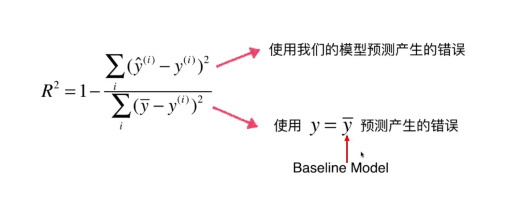
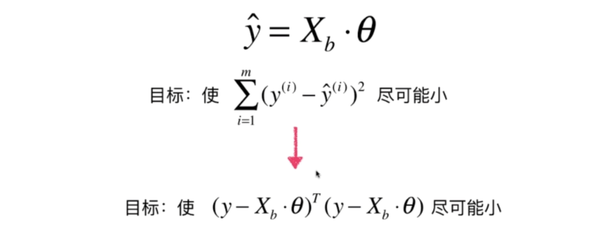
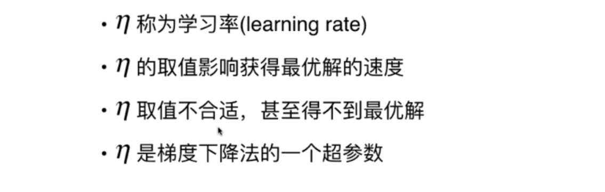

# 机器学习基础算法模型

## 1.knn算法（k-Nearest Neighbors）-k近邻算法

### k近邻算法中使用到的几个距离：欧拉距离、曼哈顿距离、明科夫斯基距离，经过推导，本质都是明科夫斯基距离


式中的a和b分别代表第a个和第b个样本，1,2,3,....,n代表a/b样本中的第1,2,3,...,n个维度


### knn算法的基本过程

```python
import numpy as np
import matplotlib.pyplot as plt

raw_data_X = [[3.393533211, 2.331273381],
              [3.110073483, 1.781539638],
              [1.343808831, 3.368360954],
              [3.582294042, 4.679179110],
              [2.280362439, 2.866990263],
              [7.423436942, 4.696522875],
              [5.745051997, 3.533989803],
              [9.172168622, 2.511101045],
              [7.792783481, 3.424088941],
              [7.939820817, 0.791637231]
             ]
raw_data_y = [0, 0, 0, 0, 0, 1, 1, 1, 1, 1]
X_train = np.array(raw_data_X)
y_train = np.array(raw_data_y)
#待预测的x
x = np.array([8.093607318, 3.365731514])
k = 6
from math import sqrt
#首先要找出与x距离最近的6个点，此处使用欧拉距离，因此要计算distance
distances = []
for x_train in X_train:
    distances.append(sqrt(np.sum((x_train - x) ** 2)))
#筛选出k个最小的,因此需要排序
#排序好得到索引
nearest = np.argsort(distances)
#找到k个与x最近的样本的类别（即y值）
topK_y = [y_train[i] for i in nearest[:k]]
#分类投票，看哪个类别占得比重大
from collections import Counter
votes = Counter(topK_y)
print(votes)
#得到预测值predict_y
predict_y = votes.most_common(1)[0][0]
```

### 使用scikit-learn中的knn算法

```python
from sklearn.neighbors import KNeighborsClassifier
knn_classifier = KNeighborsClassifier(n_neighbors=6)
knn_classifier.fit(X_train,y_train)
x= x.reshape(1,-1)
y_predict = knn_classifier.predict(x)
print(y_predict)
```

### 模拟封装scikit-learn中的knn算法

```python
class KNNClassifier:
    def __init__(self,k):
        assert k >= 1,"k must be valid"
        self.k = k
        self.__X_train = None
        self.__y_train = None
    def fit(self,X_train,y_train):
        assert self.k <= X_train.shape[0], "k must be valid"
        assert X_train.shape[0] == y_train.shape[0], \
            "the size of X_train must be equal to the size of y_train"

        """根据训练数据集"X_train和y_train"训练KNN分类器"""
        self.__X_train = X_train
        self.__y_train = y_train
        return self
    def predict(self,X_predict):
        assert self.__X_train is not None and self.__y_train is not None,\
        "must fit before predict"
        assert X_predict.shape[1] == self.__X_train.shape[1],\
        "the feature number of X_predict must be equal to X_train"
        y_predict = [self._predict(x) for x in X_predict]
        return np.array(y_predict)
    def _predict(self,x):
        assert x.shape[0] == self.__X_train.shape[1],\
        "the feature number of x must be equal to X_train"
        # 计算距离
        distances = [sqrt(np.sum((x_train - x) ** 2)) for x_train in self.__X_train]
        # 排序
        nearest = np.argsort(distances)
        topK_y = [self.__y_train[i] for i in nearest[:self.k]]
        # 分类投票
        votes = Counter(topK_y)
        # 得出预测结果
        predict_y = votes.most_common(1)[0][0]
        return predict_y
    def __str__(self):
        return "k=%d"%(self.k)
    def __repr__(self):
        return "k=%d"%(self.k)
```

### 训练数据集和测试数据集分离

#### 使用sklearn中的train_test_split

```python
from sklearn.model_selection import train_test_split
X_train,X_test,y_train,y_test = train_test_split(X,y,test_size=0.2,random_state=666)
print(X_train.shape)
```

#### 模拟封装sklearn中的train_test_split

```python
import numpy as np
def train_test_split(X,y,test_radio = 0.2,seed = None):
    assert X.shape[0] == y.shape[0],\
    "the size of X must be equal to the size of y"
    assert 0<=test_radio<=1,\
    "test_radio must be valid"
    if seed:
        np.random.seed(seed)

    shuffled_indexes = np.random.permutation(len(X))
    test_size = int(len(X) * test_radio)
    test_indexes = shuffled_indexes[:test_size]
    train_indexes = shuffled_indexes[test_size:]
    X_test = X[test_indexes]
    y_test = y[test_indexes]
    X_train = X[train_indexes]
    y_train = y[train_indexes]
    return X_train,X_test,y_train,y_test
```

### 分类准确度

#### 使用sklearn中的accuracy_score

```python
import numpy as np
from sklearn import datasets
digits = datasets.load_digits()
X = digits.data
y = digits.target
from sklearn.model_selection import train_test_split
X_train,X_test,y_train,y_test = train_test_split(X,y,test_size=0.2,random_state=666)
from sklearn.neighbors import KNeighborsClassifier
knn_classifier = KNeighborsClassifier(n_neighbors=6)
knn_classifier.fit(X_train,y_train)
y_predict = knn_classifier.predict(X_test)
#sklearn中的accuracy_score
from sklearn.metrics import accuracy_score
accuracy_score(y_test,y_predict)
```

#### 模拟封装accuracy_score

```python
def accuracy_score(y_true,y_predict):
    """计算y_true和y_predict之间的准确率"""
    assert y_true.shape[0] == y_predict.shape[0],\
    "the size of y_true must be equal to the size of y_predict"

    return sum(y_true == y_predict) / len(y_predict)
```

### 超参数和模型参数


#### 在knn算法中寻找最好的超参数K值

```python
best_score = 0
best_k = -1
for k in range(1,11):
    knn_classifier = KNeighborsClassifier(n_neighbors=k)
    knn_classifier.fit(X_train,y_train)
    score = knn_classifier.score(X_test,y_test)
    if score > best_score:
        best_score = score
        best_k = k
print("best_k",best_k)
print("best_score",best_score)
```

#### knn算法默认不考虑距离的权重，但有些情况下考虑权重是相对比较合适的，我们可以通过设置weights属性决定knn算法是否考虑距离权重。我们可以以距离的倒数作为权重。

#### 算法实现（自己思考的）：先选出k个距离最近的（可得到他们的索引和距离）,然后需要统计他们所属的类别（可以轻易得出，可以采取遍历放在dict的策略），然后根据类别分别计算出权重和，得出最后答案。

#### knn算法中weights也是一个超参数

```python
best_method = ""
best_score = 0
best_k = -1
for method in ["uniform","distance"]:
    for k in range(1,11):
        knn_classifier = KNeighborsClassifier(n_neighbors=k,weights=method)
        knn_classifier.fit(X_train,y_train)
        score = knn_classifier.score(X_test,y_test)
        if score > best_score:
            best_method = method
            best_score = score
            best_k = k
print("best_k",best_k)
print("best_score",best_score)
print("best_method",best_method)
```

#### sklearn中knn算法使用的是明科夫斯基距离，默认取2，即为欧拉距离，对于sklearn中我们还可以对明科夫斯基距离中的p这一超参数进行搜索

```python
best_p = -1
best_score = 0
best_k = -1
for p in range(1,6):
    for k in range(1,11):
        knn_classifier = KNeighborsClassifier(n_neighbors=k,p=p)
        knn_classifier.fit(X_train,y_train)
        score = knn_classifier.score(X_test,y_test)
        if score > best_score:
            best_p = p
            best_score = score
            best_k = k
print("best_k",best_k)
print("best_score",best_score)
print("best_p",best_p)
```

### 网格化搜索确定最佳超参数

```python
import numpy as np
from sklearn import datasets
from sklearn.neighbors import KNeighborsClassifier
from sklearn.model_selection import train_test_split
from sklearn.model_selection import GridSearchCV

digits = datasets.load_digits()
X = digits.data
y = digits.target
X_train,X_test,y_train,y_test = train_test_split(X,y,test_size=0.2,random_state = 666)
knn_classifier = KNeighborsClassifier()
param_grid = [
    {
        'weights': ['uniform'], 
        'n_neighbors': [i for i in range(1, 11)]
    },
    {
        'weights': ['distance'],
        'n_neighbors': [i for i in range(1, 11)], 
        'p': [i for i in range(1, 6)]
    }
]
grid_search = GridSearchCV(knn_classifier,param_grid)
grid_search.fit(X_train,y_train)

knn_classifier = grid_search.best_estimator_
knn_classifier.score(X_test,y_test)
```

### knn算法默认使用明科夫斯基距离，可以通过改变metrics参数改用其他距离计算公式

### 数据归一化：最好使用均值方差归一化

#### 防止距离被某一特征所主导，数据归一化就是将所有的数据映射到统一尺度


### 均值方差归一化比最值归一化好在哪个地方？

#### 最值归一化：缺点是抗干扰能力弱，受离群值影响比较大，中间容易没有数据。最大最小值归一化后的数据落在[0,1]之间。假设某个特征下有一组数据：1,2,3,4,5,100那么对数据使用最大最小值归一化后的值为：0,2/99,3/99,4/99,1。中间没有数据，受离群值100的影响大。适用于有明显边界的情况，比如说成绩

####方差归一化抗干扰能力强，和所有数据有关，求标准差需要所有的值介入，若有离群值，会被抑制下来。但是归一化后的数据最终的结果不一定落在0到1之间。几乎适用于所有情况

#### 最值归一化

```python
import numpy as np
x = np.random.randint(0,100,100)
x = np.array(x,dtype=float)
#对一维数组进行最值归一化
(x - np.min(x)) / (np.max(x) - np.min(x))

X = x.reshape(50,2)
#对二维数组进行最值归一化
X[:,0] = (X[:,0] - np.min(X[:,0])) / (np.max(X[:,0]) - np.min(X[:,0]))
X[:,1] = (X[:,1] - np.min(X[:,1])) / (np.max(X[:,1]) - np.min(X[:,1]))
# X
print(np.mean(X[:,0]))
print(np.std(X[:,0]))
```

#### 均值方差归一化

```python
import numpy as np
x = np.random.randint(0,100,100)
x = np.array(x,dtype=float)
#对一维数组进行均值方差归一化
# x = (x - np.mean(x)) / np.std(x)
# print(x)
# print(x.mean())
# print(x.std())
X = x.reshape(50,2)
#对二维数组进行均值方差归一化
X[:,0] = (X[:,0] - np.mean(X[:,0])) / np.std(X[:,0])
X[:,1] = (X[:,1] - np.mean(X[:,1])) / np.std(X[:,1])
# X
print(np.mean(X[:,0]))
print(np.std(X[:,0]))

print(np.mean(X[:,1]))
print(np.std(X[:,1]))
```

### 注意点:测试数据集的归一化要使用训练数据集的均值和方差，因为真实环境下的所有数据均值和方差是不知道的；


### 使用scikit-learn中的Scaler对数据进行归一化

```python
import numpy as np
from sklearn import datasets
iris = datasets.load_iris()
X = iris.data
y = iris.target
from sklearn.model_selection import train_test_split
X_train,X_test,y_train,y_test = train_test_split(X,y,test_size=0.2,random_state=666)
from sklearn.preprocessing import StandardScaler
standardScaler = StandardScaler()
standardScaler.fit(X_train)
#fit之后standardScaler中保存了这组数据的均值、方差等信息
print(standardScaler.mean_)
print(standardScaler.scale_)
#使用transform真正实现对数据的归一化
X_train = standardScaler.transform(X_train)
X_test = standardScaler.transform(X_test)

print(np.mean(X_train[:,0]))
print(np.std(X_train[:,0]))
print(np.mean(X_test[:,0]))
print(np.std(X_test[:,0]))
```

#### 模拟StandardScaler实现

```python
import numpy as np
class StandardScaler:
    def __init__(self):
        self.mean_ = None
        self.scale_ = None
        self.column_ = None
    def fit(self,X_train):
        assert X_train.ndim == 2,"the dimension of X_train must be 2"
        """根据传来的X_trian数据集得到均值和方差"""
        self.column_ = X_train.shape[1]
        self.mean_ = np.array([np.mean(X_train[:,col])for col in range(self.column_)])
        self.scale_ = np.array([np.std(X_train[:,col]) for col in range(self.column_)])
        return self
    def transform(self,X):
        assert X.ndim == 2, "the dimension of X_train must be 2"
        assert self.mean_ is not None and self.scale_ is not None and self.column_ is not None,\
        "must fit before transform"
        assert self.column_ == X.shape[1],\
        "the feature number of X must be equal the fit's X_train"
        resX = np.empty(shape=X.shape,dtype=float)
        for col in range(self.column_):
            resX[:,col] = (X[:,col] - self.mean_[col]) / self.scale_[col]
        return resX
    def __repr__(self):
        return "自定义StandardScaler"
```

### 总结：

#### (1)K近邻算法是一个天然解决分类问题的算法，天然解决多分类问题

#### (2)K近邻算法也可以解决回归问题（KNeighborsRegressor类）

### K近邻算法的缺点

#### （1）K近邻算法效率低下

#### （2）高度数据相关：如果k取3，如果周围有两个数据错误而就预测错了

#### （3）预测结果具有不可解释性

#### （4）维数灾难：随着维数的增加，看似很近的两个点距离越来越远


## 2.线性回归算法

### 简单线性回归：只有一个特征


### 简单线性回归实现

```python
import numpy as np
import matplotlib.pyplot as plt

x = np.array([1., 2., 3., 4., 5.])
y = np.array([1., 3., 2., 3., 5.])

x_mean = np.mean(x)
y_mean = np.mean(y)
#分子和
num = 0.0
#分母和
d = 0.0
for x_i,y_i in zip(x,y):
    num += (x_i - x_mean) * (y_i - y_mean)
    d += (x_i - x_mean) ** 2
a = num / d
b = y_mean - a * x_mean
print(a)
print(b)
```

### 向量化运算


### 简单线性回归封装:不使用向量化运算

```python
import numpy as np

class SimpleLinearRegression1:
    def __init__(self):
        self.a_ = None
        self.b_ = None
    def fit(self,x_train,y_train):
        assert x_train.ndim == 1,\
            "simpleLinearRegression can only solve singal feature training data"
        assert len(x_train) == len(y_train),\
            "the size of x must be equal to the size of y"
        x_mean = np.mean(x_train)
        y_mean = np.mean(y_train)
        #分子和
        num = 0
        #分母和
        d = 0
        for x_i,y_i in zip(x_train,y_train):
            num += (x_i - x_mean) * (y_i - y_mean)
            d += (x_i - x_mean) **2
        self.a_ = num / d
        self.b_ = y_mean - self.a_ * x_mean
        return self
    def predict(self,x_predict):
        """给定待测数据集x_predict,返回结果向量"""
        assert x_predict.ndim == 1, \
            "simpleLinearRegression can only solve singal feature training data"
        assert self.a_ is not None and self.b_ is not None,\
            "must fit before predict"
        return np.array([self.__predict(x) for x in x_predict])
    def __predict(self,x):
        return self.a_ * x + self.b_
    def __repr__(self):
        return "自定义的简单的SimpleLinearRegression1"
```

### 简单线性回归封装:使用向量化运算

```python
#向量化计算
class SimpleLinearRegression2:
    def __init__(self):
        self.a_ = None
        self.b_ = None
    def fit(self,x_train,y_train):
        assert x_train.ndim == 1,\
            "simpleLinearRegression can only solve singal feature training data"
        assert len(x_train) == len(y_train),\
            "the size of x must be equal to the size of y"
        x_mean = np.mean(x_train)
        y_mean = np.mean(y_train)
        #求分子和、分母和的时候使用向量化运算提高效率
        #分子和
        num = (x_train - x_mean).dot(y_train - y_mean)
        #分母和
        d = (x_train - x_mean).dot(x_train - x_mean)
        self.a_ = num / d
        self.b_ = y_mean - self.a_ * x_mean
        return self
    def predict(self,x_predict):
        """给定待测数据集x_predict,返回结果向量"""
        assert x_predict.ndim == 1, \
            "simpleLinearRegression can only solve singal feature training data"
        assert self.a_ is not None and self.b_ is not None,\
            "must fit before predict"
        return np.array([self.__predict(x) for x in x_predict])
    def __predict(self,x):
        return self.a_ * x + self.b_
    def __repr__(self):
        return "自定义的简单的SimpleLinearRegression2"
```

### 衡量线性回归的指标

#### 思考找到一个衡量标准的过程，如图所示


#### 上述这个衡量标准和测试数据集m有关,由此联想到均方误差，如图


#### 均方误差可能存在的问题是量纲的问题，由于平方的原因，(万元)^2 = 万元的平方

#### 由此便产生了均方根误差，如图


#### 还有一个评价线性回归算法的标准：平均绝对误差，如图


### 衡量线性回归性能指标代码实现

```python
import numpy as np
from sklearn import datasets
import matplotlib.pyplot as plt

#准备数据
boston = datasets.load_boston()
boston.DESCR
boston.feature_names
x = boston.data[:,5]
print(x.shape)
y = boston.target
print(y.shape)
#观察数据
plt.scatter(x,y)
plt.show()
#对数据进行预处理
x = x[y < 50]
y = y[y < 50]
#训练模型
from sklearn.model_selection import train_test_split
x_train,x_test,y_train,y_test = train_test_split(x,y,test_size=0.2,random_state=666)
%run ../pycharmcode/knn/simpleLinearRegression.py
simpleLinearRegression = SimpleLinearRegression2()
simpleLinearRegression.fit(x_train,y_train)
#绘制
plt.scatter(x_train,y_train)
plt.plot(x_train,simpleLinearRegression.predict(x_train),color='r')
plt.show()
#得到线性回归算法的MSE、RMSE、MAE指标
#MSE
mse = np.sum((y_test - y_predict) ** 2) / len(y_test)
#RMSE
from math import sqrt
rmse = sqrt(mse)
#MAE
mae = np.sum(np.absolute(y_test - y_predict)) / len(y_test)
```

#### 使用scikit-learn中计算MSE、RMSE、MAE的方法

```python
from sklearn.metrics import mean_squared_error
mean_squared_error(y_test,y_predict)
from sklearn.metrics import mean_absolute_error
mean_absolute_error(y_test,y_predict)
```

#### 模拟封装scikit-learn中的MSE、RMSE、MAE

```python
def mean_squared_error(y_true,y_predict):
    """衡量线性回归算法性能指标1.均方误差"""
    assert len(y_true) == len(y_predict),\
        "the size of y_true must be equal to the size of y_predict"
    return np.sum((y_true - y_predict) ** 2) / len(y_true)
def root_squared_error(y_true,y_predict):
    """衡量线性回归算法性能指标2.均方根误差"""
    return sqrt(mean_squared_error(y_true,y_predict))
def mean_absolute_error(y_true,y_predict):
    """衡量线性回归算法性能指标3.平均绝对误差"""
    assert len(y_true) == len(y_predict), \
        "the size of y_true must be equal to the size of y_predict"
    return np.sum(np.absolute(y_true - y_predict)) / len(y_true)
```

#### RMSE和MAE的比较

#### 通常情况下RMSE得出的结果比MAE值要大，这是因为RMSE是通过平方得到的，这相当于扩大了误差，因此我们寻求最小RMSE，一定程度上是在尽量减小误差最大的样本，这是十分有意义的，同时，我们选取的损失函数也是使用平方的形式，也可以说在训练的时候我们就在减小误差最大的样本。

#### RMSE和MAE的局限性：假如我们预测房产得到的RMSE/MAE的值是5，而我们预测学生成绩得到的RMSE/MAE的值是10，那么我们如何判定这个模型作用在哪类问题预测上较好呢？解决方案是使用R Squared

### 最好的衡量线性回归算法的指标：R Squared





```python
import numpy as np
from sklearn import datasets
import matplotlib.pyplot as plt

#准备数据
boston = datasets.load_boston()
boston.DESCR
boston.feature_names
x = boston.data[:,5]
print(x.shape)
y = boston.target
print(y.shape)
#观察数据
plt.scatter(x,y)
plt.show()
#对数据进行预处理
x = x[y < 50]
y = y[y < 50]
#训练模型
from sklearn.model_selection import train_test_split
x_train,x_test,y_train,y_test = train_test_split(x,y,test_size=0.2,random_state=666)
%run ../pycharmcode/knn/simpleLinearRegression.py
simpleLinearRegression = SimpleLinearRegression2()
simpleLinearRegression.fit(x_train,y_train)
#绘制
plt.scatter(x_train,y_train)
plt.plot(x_train,simpleLinearRegression.predict(x_train),color='r')
plt.show()
#得到线性回归算法的MSE、RMSE、MAE指标
#MSE
mse = np.sum((y_test - y_predict) ** 2) / len(y_test)
#RMSE
from math import sqrt
rmse = sqrt(mse)
#MAE
mae = np.sum(np.absolute(y_test - y_predict)) / len(y_test)
#r_squared
r_squared = 1 - mean_squared_error(y_test,y_predict) / np.var(y_test)
print(r_squared)
```

```python
#在metrics中增加r2_score算法实现
def r2_score(y_true,y_predict):
    """最好的衡量线性回归算法性能指标.R Squared算法"""
    return 1 - mean_squared_error(y_true,y_predict) / np.var(y_true)
```

```python
#使用scikit-learn中的r2_score
from sklearn.metrics import r2_score
r2_score(y_test,y_predict)
```

### 多元线性回归


#### 多元线性回归方程求解方式1：使用正规化方程解





#### 封装我们的LinearRegression，使用正规化方程的解法1

```python
import numpy as np
# from .metrics import r2_score
class LinearRegression:
    def __init__(self):
        self.conef_ = None
        self.interception_ = None
        self.__theta = None
    def fit(self,X_train,y_train):
        assert X_train.shape[0] == y_train.shape[0],\
            "the size of X_train must be equal to the size of y_train"
        X_b = np.hstack([np.ones(shape=(len(X_train),1)),X_train])
        self.__theta = np.linalg.inv(X_b.T.dot(X_b)).dot(X_b.T).dot(y_train)
        self.interception_ = self.__theta[0]
        self.conef_ = self.__theta[1:]
        return self
    def predict(self,X_predict):
        assert self.conef_ is not None and self.interception_ is not None,\
            "must fit before predict"
        assert X_predict.shape[1] == len(self.conef_),\
            "the feature number of X_predict must be equal to X_train "
        X_b = np.hstack([np.ones(shape=(len(X_predict), 1)), X_predict])
        return X_b.dot(self.__theta)
    # def score(self,X_predict,y_true):
    #     y_predict = self.predict(X_predict)
    #     return r2_score(y_true,y_predict)
    def __repr__(self):
        return "自定义的LinearRegression"
```

#### 使用我们封装的LinearRegression解决实际问题

```python
import numpy as np
from sklearn import datasets
#准备数据
boston = datasets.load_boston()
X = boston.data
y = boston.target
X = X[y < 50]
y = y[y < 50]
print(X.shape)
print(y.shape)
from sklearn.model_selection import train_test_split
X_train,X_test,y_train,y_test = train_test_split(X,y,test_size = 0.2,random_state=666)
#训练模型
%run ../pycharmcode/knn/LinearRegression
linearRegression = LinearRegression()
linearRegression.fit(X_train,y_train)
print(linearRegression.interception_)
print(linearRegression.conef_)
```

#### 使用scikit-learn中封装的解决线性回归问题

```python
import numpy as np
from sklearn import datasets

boston = datasets.load_boston()
X = boston.data
y = boston.target
X = X[y < 50]
y = y[y < 50]
from sklearn.model_selection import train_test_split
X_train,X_test,y_train,y_test = train_test_split(X,y,test_size = 0.2,random_state=666)

from sklearn.linear_model import LinearRegression
linearRegression = LinearRegression()
linearRegression.fit(X_train,y_train)
print(linearRegression.intercept_)
print(linearRegression.coef_)
print(linearRegression.score(X_test,y_test))
```

#### 使用Knn Regressor解决回归问题

```python
from sklearn.neighbors import KNeighborsRegressor
knn_regressor = KNeighborsRegressor()
knn_regressor.fit(X_train,y_train)
knn_regressor.score(X_test,y_test)
```

```python
from sklearn.model_selection import GridSearchCV
param_grid = [
    {
        "weights": ["uniform"],
        "n_neighbors": [i for i in range(1, 11)]
    },
    {
        "weights": ["distance"],
        "n_neighbors": [i for i in range(1, 11)],
        "p": [i for i in range(1,6)]
    }
]
gridSearchCV = GridSearchCV(knn_regressor,param_grid=param_grid)
gridSearchCV.fit(X_train,y_train)
gridSearchCV.best_estimator_.score(X_test,y_test)
```

### 线性回归算法总结：

#### (1)典型的参数学习（对比KNN的非参数学习）

#### (2)只能解决回归问题，虽然很多分类方法中，线性回归是基础(如逻辑回归)

#### (3)对比KNN，既能解决分类问题，也能解决回归问题

#### (4)在使用线性回归算法解决问题时，我们假设数据是线性的，而对比KNN来说，KNN的数据是没有假设的

#### (5)线性回归算法的优点：对数据具有强解释性(如系数为正，这个系数对应的特征对总体结果呈正相关，系数为负，表示这个系数对应的特征对总体结果呈负相关)

## 3.梯度下降法

### 梯度下降法不是一个机器学习算法，不能解决分类问题，也不能解决回归问题，是一种基于搜索的最优化方法，它的作用是优化目标函数，如最小化一个损失函数；梯度上升法是最大化一个效用函数





#### 梯度下降法的简单模拟

```python
import numpy as np
import matplotlib.pyplot as plt

plot_x = np.linspace(-1,6,141)
plot_y = (plot_x - 2.5) ** 2 - 1
plt.plot(plot_x,plot_y)
plt.show()

def dJ(theta):
    return 2 * (theta - 2.5)
def J(theta):
    return (theta - 2.5) ** 2 - 1
    
eta = 0.1
epsilon = 1e-8
theta = 0.0
while True:
    gradient = dJ(theta)
    last_theta = theta
    theta = theta - eta * gradient
    if(abs(J(theta) - J(last_theta)) < epsilon):
        break
print(theta)
print(J(theta))    
```

