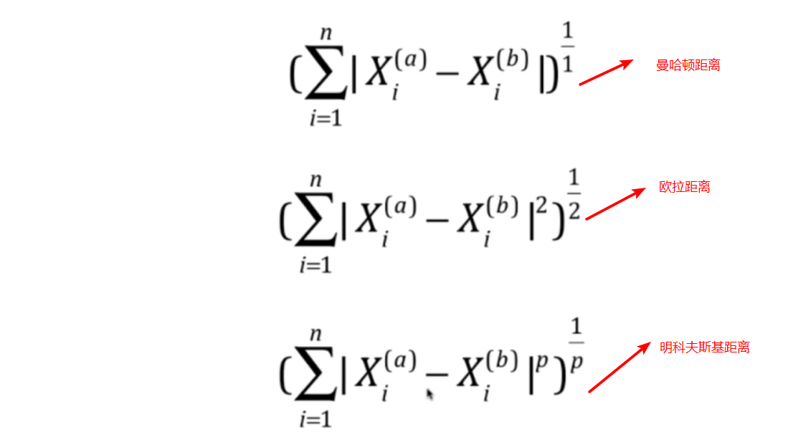
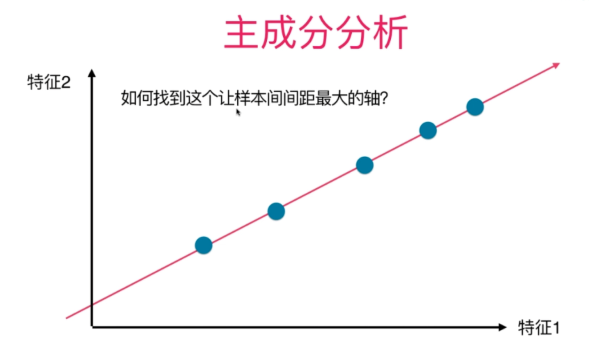
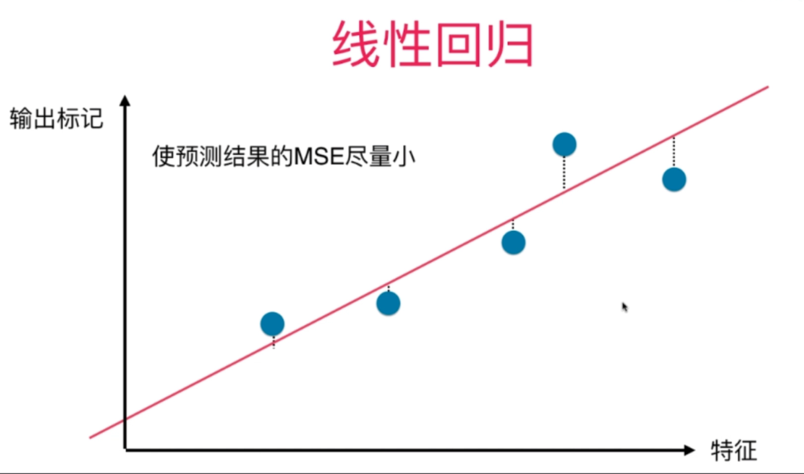
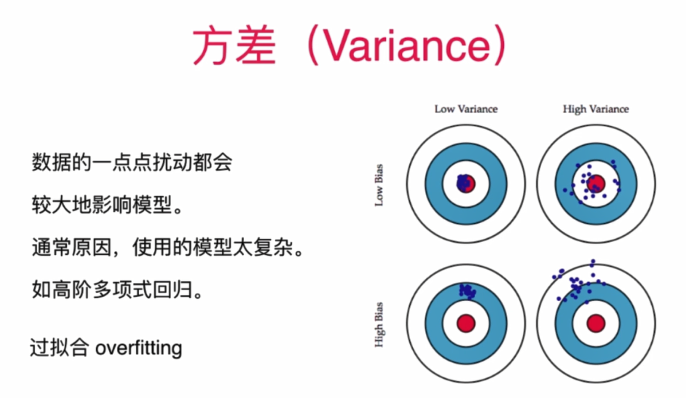
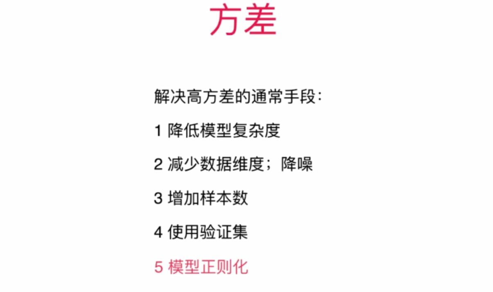
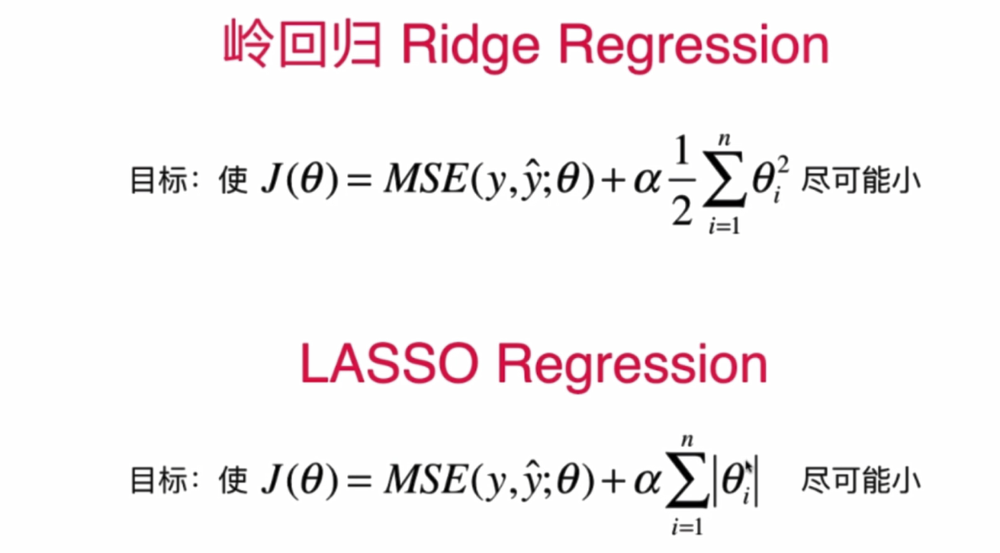
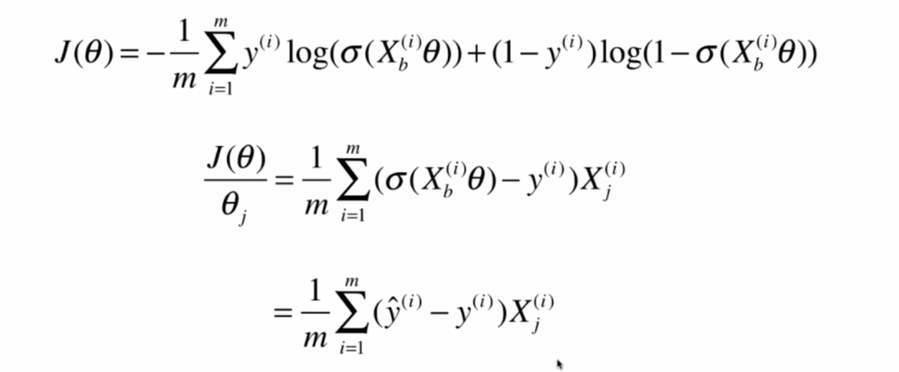
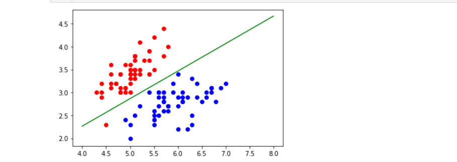
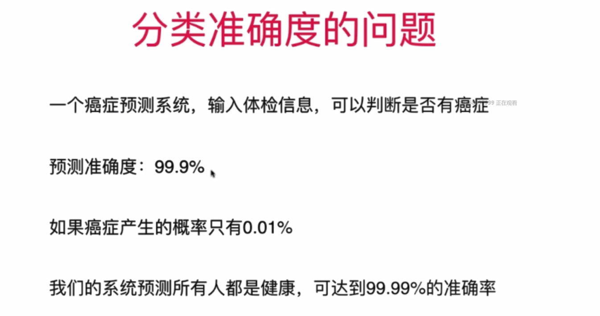
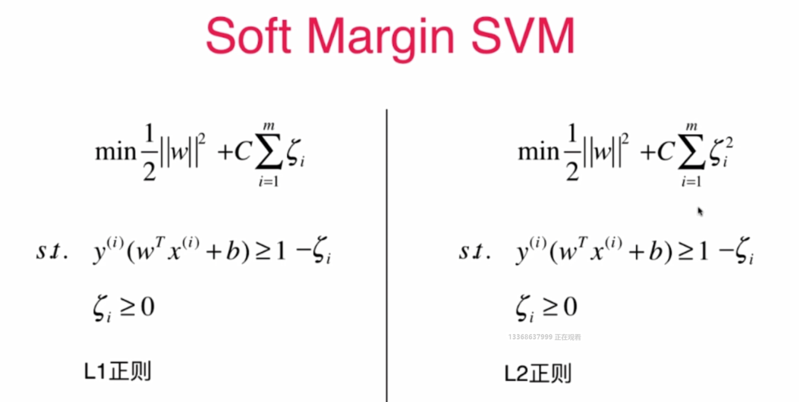

机器学习基础算法模型

## 1.knn算法（k-Nearest Neighbors）-k近邻算法

### k近邻算法中使用到的几个距离：欧拉距离、曼哈顿距离、明科夫斯基距离，经过推导，本质都是明科夫斯基距离


式中的a和b分别代表第a个和第b个样本，1,2,3,....,n代表a/b样本中的第1,2,3,...,n个维度





### knn算法的基本过程

```python
import numpy as np
import matplotlib.pyplot as plt

raw_data_X = [[3.393533211, 2.331273381],
              [3.110073483, 1.781539638],
              [1.343808831, 3.368360954],
              [3.582294042, 4.679179110],
              [2.280362439, 2.866990263],
              [7.423436942, 4.696522875],
              [5.745051997, 3.533989803],
              [9.172168622, 2.511101045],
              [7.792783481, 3.424088941],
              [7.939820817, 0.791637231]
             ]
raw_data_y = [0, 0, 0, 0, 0, 1, 1, 1, 1, 1]
X_train = np.array(raw_data_X)
y_train = np.array(raw_data_y)
#待预测的x
x = np.array([8.093607318, 3.365731514])
k = 6
from math import sqrt
#首先要找出与x距离最近的6个点，此处使用欧拉距离，因此要计算distance
distances = []
for x_train in X_train:
    distances.append(sqrt(np.sum((x_train - x) ** 2)))
#筛选出k个最小的,因此需要排序
#排序好得到索引
nearest = np.argsort(distances)
#找到k个与x最近的样本的类别（即y值）
topK_y = [y_train[i] for i in nearest[:k]]
#分类投票，看哪个类别占得比重大
from collections import Counter
votes = Counter(topK_y)
print(votes)
#得到预测值predict_y
predict_y = votes.most_common(1)[0][0]
```

### 使用scikit-learn中的knn算法

```python
from sklearn.neighbors import KNeighborsClassifier
knn_classifier = KNeighborsClassifier(n_neighbors=6)
knn_classifier.fit(X_train,y_train)
x= x.reshape(1,-1)
y_predict = knn_classifier.predict(x)
print(y_predict)
```

### 模拟封装scikit-learn中的knn算法

```python
class KNNClassifier:
    def __init__(self,k):
        assert k >= 1,"k must be valid"
        self.k = k
        self.__X_train = None
        self.__y_train = None
    def fit(self,X_train,y_train):
        assert self.k <= X_train.shape[0], "k must be valid"
        assert X_train.shape[0] == y_train.shape[0], \
            "the size of X_train must be equal to the size of y_train"

        """根据训练数据集"X_train和y_train"训练KNN分类器"""
        self.__X_train = X_train
        self.__y_train = y_train
        return self
    def predict(self,X_predict):
        assert self.__X_train is not None and self.__y_train is not None,\
        "must fit before predict"
        assert X_predict.shape[1] == self.__X_train.shape[1],\
        "the feature number of X_predict must be equal to X_train"
        y_predict = [self._predict(x) for x in X_predict]
        return np.array(y_predict)
    def _predict(self,x):
        assert x.shape[0] == self.__X_train.shape[1],\
        "the feature number of x must be equal to X_train"
        # 计算距离
        distances = [sqrt(np.sum((x_train - x) ** 2)) for x_train in self.__X_train]
        # 排序
        nearest = np.argsort(distances)
        topK_y = [self.__y_train[i] for i in nearest[:self.k]]
        # 分类投票
        votes = Counter(topK_y)
        # 得出预测结果
        predict_y = votes.most_common(1)[0][0]
        return predict_y
    def __str__(self):
        return "k=%d"%(self.k)
    def __repr__(self):
        return "k=%d"%(self.k)
```

### 训练数据集和测试数据集分离

#### 使用sklearn中的train_test_split

```python
from sklearn.model_selection import train_test_split
X_train,X_test,y_train,y_test = train_test_split(X,y,test_size=0.2,random_state=666)
print(X_train.shape)
```

#### 模拟封装sklearn中的train_test_split

```python
import numpy as np
def train_test_split(X,y,test_radio = 0.2,seed = None):
    assert X.shape[0] == y.shape[0],\
    "the size of X must be equal to the size of y"
    assert 0<=test_radio<=1,\
    "test_radio must be valid"
    if seed:
        np.random.seed(seed)

    shuffled_indexes = np.random.permutation(len(X))
    test_size = int(len(X) * test_radio)
    test_indexes = shuffled_indexes[:test_size]
    train_indexes = shuffled_indexes[test_size:]
    X_test = X[test_indexes]
    y_test = y[test_indexes]
    X_train = X[train_indexes]
    y_train = y[train_indexes]
    return X_train,X_test,y_train,y_test
```

### 分类准确度

#### 使用sklearn中的accuracy_score

```python
import numpy as np
from sklearn import datasets
digits = datasets.load_digits()
X = digits.data
y = digits.target
from sklearn.model_selection import train_test_split
X_train,X_test,y_train,y_test = train_test_split(X,y,test_size=0.2,random_state=666)
from sklearn.neighbors import KNeighborsClassifier
knn_classifier = KNeighborsClassifier(n_neighbors=6)
knn_classifier.fit(X_train,y_train)
y_predict = knn_classifier.predict(X_test)
#sklearn中的accuracy_score
from sklearn.metrics import accuracy_score
accuracy_score(y_test,y_predict)
```

#### 模拟封装accuracy_score

```python
def accuracy_score(y_true,y_predict):
    """计算y_true和y_predict之间的准确率"""
    assert y_true.shape[0] == y_predict.shape[0],\
    "the size of y_true must be equal to the size of y_predict"

    return sum(y_true == y_predict) / len(y_predict)
```

### 超参数和模型参数


#### 在knn算法中寻找最好的超参数K值

```python
best_score = 0
best_k = -1
for k in range(1,11):
    knn_classifier = KNeighborsClassifier(n_neighbors=k)
    knn_classifier.fit(X_train,y_train)
    score = knn_classifier.score(X_test,y_test)
    if score > best_score:
        best_score = score
        best_k = k
print("best_k",best_k)
print("best_score",best_score)
```

#### knn算法默认不考虑距离的权重，但有些情况下考虑权重是相对比较合适的，我们可以通过设置weights属性决定knn算法是否考虑距离权重。我们可以以距离的倒数作为权重。

#### 算法实现（自己思考的）：先选出k个距离最近的（可得到他们的索引和距离）,然后需要统计他们所属的类别（可以轻易得出，可以采取遍历放在dict的策略），然后根据类别分别计算出权重和，得出最后答案。

#### knn算法中weights也是一个超参数

```python
best_method = ""
best_score = 0
best_k = -1
for method in ["uniform","distance"]:
    for k in range(1,11):
        knn_classifier = KNeighborsClassifier(n_neighbors=k,weights=method)
        knn_classifier.fit(X_train,y_train)
        score = knn_classifier.score(X_test,y_test)
        if score > best_score:
            best_method = method
            best_score = score
            best_k = k
print("best_k",best_k)
print("best_score",best_score)
print("best_method",best_method)
```

#### sklearn中knn算法使用的是明科夫斯基距离，默认取2，即为欧拉距离，对于sklearn中我们还可以对明科夫斯基距离中的p这一超参数进行搜索

```python
best_p = -1
best_score = 0
best_k = -1
for p in range(1,6):
    for k in range(1,11):
        knn_classifier = KNeighborsClassifier(n_neighbors=k,p=p)
        knn_classifier.fit(X_train,y_train)
        score = knn_classifier.score(X_test,y_test)
        if score > best_score:
            best_p = p
            best_score = score
            best_k = k
print("best_k",best_k)
print("best_score",best_score)
print("best_p",best_p)
```

### 网格化搜索确定最佳超参数

```python
import numpy as np
from sklearn import datasets
from sklearn.neighbors import KNeighborsClassifier
from sklearn.model_selection import train_test_split
from sklearn.model_selection import GridSearchCV

digits = datasets.load_digits()
X = digits.data
y = digits.target
X_train,X_test,y_train,y_test = train_test_split(X,y,test_size=0.2,random_state = 666)
knn_classifier = KNeighborsClassifier()
param_grid = [
    {
        'weights': ['uniform'], 
        'n_neighbors': [i for i in range(1, 11)]
    },
    {
        'weights': ['distance'],
        'n_neighbors': [i for i in range(1, 11)], 
        'p': [i for i in range(1, 6)]
    }
]
grid_search = GridSearchCV(knn_classifier,param_grid)
grid_search.fit(X_train,y_train)

knn_classifier = grid_search.best_estimator_
knn_classifier.score(X_test,y_test)
```

### knn算法默认使用明科夫斯基距离，可以通过改变metrics参数改用其他距离计算公式

### 数据归一化：最好使用均值方差归一化

#### 防止距离被某一特征所主导，数据归一化就是将==各类数据==映射到==统一尺度==


### 均值方差归一化比最值归一化好在哪个地方？

#### 最值归一化：缺点是抗干扰能力弱，受离群值影响比较大，中间容易没有数据。最大最小值归一化后的数据落在[0,1]之间。假设某个特征下有一组数据：1,2,3,4,5,100那么对数据使用最大最小值归一化后的值为：0,2/99,3/99,4/99,1。中间没有数据，受离群值100的影响大。适用于有明显边界的情况，比如说成绩

####方差归一化抗干扰能力强，和所有数据有关，求标准差需要所有的值介入，若有离群值，会被抑制下来。但是归一化后的数据最终的结果不一定落在0到1之间。几乎适用于所有情况

#### 最值归一化

```python
import numpy as np
x = np.random.randint(0,100,100)
x = np.array(x,dtype=float)
#对一维数组进行最值归一化
(x - np.min(x)) / (np.max(x) - np.min(x))

X = x.reshape(50,2)
#对二维数组进行最值归一化
X[:,0] = (X[:,0] - np.min(X[:,0])) / (np.max(X[:,0]) - np.min(X[:,0]))
X[:,1] = (X[:,1] - np.min(X[:,1])) / (np.max(X[:,1]) - np.min(X[:,1]))
# X
print(np.mean(X[:,0]))
print(np.std(X[:,0]))
```

#### 均值方差归一化

```python
import numpy as np
x = np.random.randint(0,100,100)
x = np.array(x,dtype=float)
#对一维数组进行均值方差归一化
# x = (x - np.mean(x)) / np.std(x)
# print(x)
# print(x.mean())
# print(x.std())
X = x.reshape(50,2)
#对二维数组进行均值方差归一化
X[:,0] = (X[:,0] - np.mean(X[:,0])) / np.std(X[:,0])
X[:,1] = (X[:,1] - np.mean(X[:,1])) / np.std(X[:,1])
# X
print(np.mean(X[:,0]))
print(np.std(X[:,0]))

print(np.mean(X[:,1]))
print(np.std(X[:,1]))
```

### 注意点:测试数据集的归一化要使用训练数据集的均值和方差，因为真实环境下的所有数据均值和方差是不知道的；


### 使用scikit-learn中的Scaler对数据进行归一化

```python
import numpy as np
from sklearn import datasets
iris = datasets.load_iris()
X = iris.data
y = iris.target
from sklearn.model_selection import train_test_split
X_train,X_test,y_train,y_test = train_test_split(X,y,test_size=0.2,random_state=666)
from sklearn.preprocessing import StandardScaler
standardScaler = StandardScaler()
standardScaler.fit(X_train)
#fit之后standardScaler中保存了这组数据的均值、方差等信息
print(standardScaler.mean_)
print(standardScaler.scale_)
#使用transform真正实现对数据的归一化
X_train = standardScaler.transform(X_train)
X_test = standardScaler.transform(X_test)

print(np.mean(X_train[:,0]))
print(np.std(X_train[:,0]))
print(np.mean(X_test[:,0]))
print(np.std(X_test[:,0]))
```

#### 模拟StandardScaler实现

```python
import numpy as np
class StandardScaler:
    def __init__(self):
        self.mean_ = None
        self.scale_ = None
        self.column_ = None
    def fit(self,X_train):
        assert X_train.ndim == 2,"the dimension of X_train must be 2"
        """根据传来的X_trian数据集得到均值和方差"""
        self.column_ = X_train.shape[1]
        self.mean_ = np.array([np.mean(X_train[:,col])for col in range(self.column_)])
        self.scale_ = np.array([np.std(X_train[:,col]) for col in range(self.column_)])
        return self
    def transform(self,X):
        assert X.ndim == 2, "the dimension of X_train must be 2"
        assert self.mean_ is not None and self.scale_ is not None and self.column_ is not None,\
        "must fit before transform"
        assert self.column_ == X.shape[1],\
        "the feature number of X must be equal the fit's X_train"
        resX = np.empty(shape=X.shape,dtype=float)
        for col in range(self.column_):
            resX[:,col] = (X[:,col] - self.mean_[col]) / self.scale_[col]
        return resX
    def __repr__(self):
        return "自定义StandardScaler"
```

### 总结：

#### (1)K近邻算法是一个天然解决分类问题的算法，天然解决多分类问题

#### (2)K近邻算法也可以解决回归问题（KNeighborsRegressor类）

### K近邻算法的缺点

#### （1）K近邻算法效率低下

#### （2）高度数据相关：如果k取3，如果周围有两个数据错误而就预测错了

#### （3）预测结果具有不可解释性

#### （4）维数灾难：随着维数的增加，看似很近的两个点距离越来越远


## 2.线性回归算法

### 简单线性回归：只有一个特征


### 简单线性回归实现

```python
import numpy as np
import matplotlib.pyplot as plt

x = np.array([1., 2., 3., 4., 5.])
y = np.array([1., 3., 2., 3., 5.])

x_mean = np.mean(x)
y_mean = np.mean(y)
#分子和
num = 0.0
#分母和
d = 0.0
for x_i,y_i in zip(x,y):
    num += (x_i - x_mean) * (y_i - y_mean)
    d += (x_i - x_mean) ** 2
a = num / d
b = y_mean - a * x_mean
print(a)
print(b)
```

### 向量化运算


### 简单线性回归封装:不使用向量化运算

```python
import numpy as np

class SimpleLinearRegression1:
    def __init__(self):
        self.a_ = None
        self.b_ = None
    def fit(self,x_train,y_train):
        assert x_train.ndim == 1,\
            "simpleLinearRegression can only solve singal feature training data"
        assert len(x_train) == len(y_train),\
            "the size of x must be equal to the size of y"
        x_mean = np.mean(x_train)
        y_mean = np.mean(y_train)
        #分子和
        num = 0
        #分母和
        d = 0
        for x_i,y_i in zip(x_train,y_train):
            num += (x_i - x_mean) * (y_i - y_mean)
            d += (x_i - x_mean) **2
        self.a_ = num / d
        self.b_ = y_mean - self.a_ * x_mean
        return self
    def predict(self,x_predict):
        """给定待测数据集x_predict,返回结果向量"""
        assert x_predict.ndim == 1, \
            "simpleLinearRegression can only solve singal feature training data"
        assert self.a_ is not None and self.b_ is not None,\
            "must fit before predict"
        return np.array([self.__predict(x) for x in x_predict])
    def __predict(self,x):
        return self.a_ * x + self.b_
    def __repr__(self):
        return "自定义的简单的SimpleLinearRegression1"
```

### 简单线性回归封装:使用向量化运算

```python
#向量化计算
class SimpleLinearRegression2:
    def __init__(self):
        self.a_ = None
        self.b_ = None
    def fit(self,x_train,y_train):
        assert x_train.ndim == 1,\
            "simpleLinearRegression can only solve singal feature training data"
        assert len(x_train) == len(y_train),\
            "the size of x must be equal to the size of y"
        x_mean = np.mean(x_train)
        y_mean = np.mean(y_train)
        #求分子和、分母和的时候使用向量化运算提高效率
        #分子和
        num = (x_train - x_mean).dot(y_train - y_mean)
        #分母和
        d = (x_train - x_mean).dot(x_train - x_mean)
        self.a_ = num / d
        self.b_ = y_mean - self.a_ * x_mean
        return self
    def predict(self,x_predict):
        """给定待测数据集x_predict,返回结果向量"""
        assert x_predict.ndim == 1, \
            "simpleLinearRegression can only solve singal feature training data"
        assert self.a_ is not None and self.b_ is not None,\
            "must fit before predict"
        return np.array([self.__predict(x) for x in x_predict])
    def __predict(self,x):
        return self.a_ * x + self.b_
    def __repr__(self):
        return "自定义的简单的SimpleLinearRegression2"
```

### 衡量线性回归的指标

#### 思考找到一个衡量标准的过程，如图所示


#### 上述这个衡量标准和测试数据集m有关,由此联想到均方误差，如图


#### 均方误差可能存在的问题是量纲的问题，由于平方的原因，(万元)^2 = 万元的平方

#### 由此便产生了均方根误差，如图


#### 还有一个评价线性回归算法的标准：平均绝对误差，如图


### 衡量线性回归性能指标代码实现

```python
import numpy as np
from sklearn import datasets
import matplotlib.pyplot as plt

#准备数据
boston = datasets.load_boston()
boston.DESCR
boston.feature_names
x = boston.data[:,5]
print(x.shape)
y = boston.target
print(y.shape)
#观察数据
plt.scatter(x,y)
plt.show()
#对数据进行预处理
x = x[y < 50]
y = y[y < 50]
#训练模型
from sklearn.model_selection import train_test_split
x_train,x_test,y_train,y_test = train_test_split(x,y,test_size=0.2,random_state=666)
%run ../pycharmcode/knn/simpleLinearRegression.py
simpleLinearRegression = SimpleLinearRegression2()
simpleLinearRegression.fit(x_train,y_train)
#绘制
plt.scatter(x_train,y_train)
plt.plot(x_train,simpleLinearRegression.predict(x_train),color='r')
plt.show()
#得到线性回归算法的MSE、RMSE、MAE指标
#MSE
mse = np.sum((y_test - y_predict) ** 2) / len(y_test)
#RMSE
from math import sqrt
rmse = sqrt(mse)
#MAE
mae = np.sum(np.absolute(y_test - y_predict)) / len(y_test)
```

#### 使用scikit-learn中计算MSE、RMSE、MAE的方法

```python
from sklearn.metrics import mean_squared_error
mean_squared_error(y_test,y_predict)
from sklearn.metrics import mean_absolute_error
mean_absolute_error(y_test,y_predict)
```

#### 模拟封装scikit-learn中的MSE、RMSE、MAE

```python
def mean_squared_error(y_true,y_predict):
    """衡量线性回归算法性能指标1.均方误差"""
    assert len(y_true) == len(y_predict),\
        "the size of y_true must be equal to the size of y_predict"
    return np.sum((y_true - y_predict) ** 2) / len(y_true)
def root_squared_error(y_true,y_predict):
    """衡量线性回归算法性能指标2.均方根误差"""
    return sqrt(mean_squared_error(y_true,y_predict))
def mean_absolute_error(y_true,y_predict):
    """衡量线性回归算法性能指标3.平均绝对误差"""
    assert len(y_true) == len(y_predict), \
        "the size of y_true must be equal to the size of y_predict"
    return np.sum(np.absolute(y_true - y_predict)) / len(y_true)
```

#### RMSE和MAE的比较

#### 通常情况下RMSE得出的结果比MAE值要大，这是因为RMSE是通过平方得到的，这相当于扩大了误差，因此我们寻求最小RMSE，一定程度上是在尽量减小误差最大的样本，这是十分有意义的，同时，我们选取的损失函数也是使用平方的形式，也可以说在训练的时候我们就在减小误差最大的样本。

#### RMSE和MAE的局限性：假如我们预测房产得到的RMSE/MAE的值是5，而我们预测学生成绩得到的RMSE/MAE的值是10，那么我们如何判定这个模型作用在哪类问题预测上较好呢？解决方案是使用R Squared

### 最好的衡量线性回归算法的指标：R Squared


```python
import numpy as np
from sklearn import datasets
import matplotlib.pyplot as plt

#准备数据
boston = datasets.load_boston()
boston.DESCR
boston.feature_names
x = boston.data[:,5]
print(x.shape)
y = boston.target
print(y.shape)
#观察数据
plt.scatter(x,y)
plt.show()
#对数据进行预处理
x = x[y < 50]
y = y[y < 50]
#训练模型
from sklearn.model_selection import train_test_split
x_train,x_test,y_train,y_test = train_test_split(x,y,test_size=0.2,random_state=666)
%run ../pycharmcode/knn/simpleLinearRegression.py
simpleLinearRegression = SimpleLinearRegression2()
simpleLinearRegression.fit(x_train,y_train)
#绘制
plt.scatter(x_train,y_train)
plt.plot(x_train,simpleLinearRegression.predict(x_train),color='r')
plt.show()
#得到线性回归算法的MSE、RMSE、MAE指标
#MSE
mse = np.sum((y_test - y_predict) ** 2) / len(y_test)
#RMSE
from math import sqrt
rmse = sqrt(mse)
#MAE
mae = np.sum(np.absolute(y_test - y_predict)) / len(y_test)
#r_squared
r_squared = 1 - mean_squared_error(y_test,y_predict) / np.var(y_test)
print(r_squared)
```

```python
#在metrics中增加r2_score算法实现
def r2_score(y_true,y_predict):
    """最好的衡量线性回归算法性能指标.R Squared算法"""
    return 1 - mean_squared_error(y_true,y_predict) / np.var(y_true)
```

```python
#使用scikit-learn中的r2_score
from sklearn.metrics import r2_score
r2_score(y_test,y_predict)
```

### 多元线性回归


#### 多元线性回归方程求解方式1：使用正规化方程解


#### 封装我们的LinearRegression，使用正规化方程的解法1

```python
import numpy as np
# from .metrics import r2_score
class LinearRegression:
    def __init__(self):
        self.conef_ = None
        self.interception_ = None
        self.__theta = None
    def fit(self,X_train,y_train):
        assert X_train.shape[0] == y_train.shape[0],\
            "the size of X_train must be equal to the size of y_train"
        X_b = np.hstack([np.ones(shape=(len(X_train),1)),X_train])
        self.__theta = np.linalg.inv(X_b.T.dot(X_b)).dot(X_b.T).dot(y_train)
        self.interception_ = self.__theta[0]
        self.conef_ = self.__theta[1:]
        return self
    def predict(self,X_predict):
        assert self.conef_ is not None and self.interception_ is not None,\
            "must fit before predict"
        assert X_predict.shape[1] == len(self.conef_),\
            "the feature number of X_predict must be equal to X_train "
        X_b = np.hstack([np.ones(shape=(len(X_predict), 1)), X_predict])
        return X_b.dot(self.__theta)
    # def score(self,X_predict,y_true):
    #     y_predict = self.predict(X_predict)
    #     return r2_score(y_true,y_predict)
    def __repr__(self):
        return "自定义的LinearRegression"
```

#### 使用我们封装的LinearRegression解决实际问题

```python
import numpy as np
from sklearn import datasets
#准备数据
boston = datasets.load_boston()
X = boston.data
y = boston.target
X = X[y < 50]
y = y[y < 50]
print(X.shape)
print(y.shape)
from sklearn.model_selection import train_test_split
X_train,X_test,y_train,y_test = train_test_split(X,y,test_size = 0.2,random_state=666)
#训练模型
%run ../pycharmcode/knn/LinearRegression
linearRegression = LinearRegression()
linearRegression.fit(X_train,y_train)
print(linearRegression.interception_)
print(linearRegression.conef_)
```

#### 使用scikit-learn中封装的解决线性回归问题

```python
import numpy as np
from sklearn import datasets

boston = datasets.load_boston()
X = boston.data
y = boston.target
X = X[y < 50]
y = y[y < 50]
from sklearn.model_selection import train_test_split
X_train,X_test,y_train,y_test = train_test_split(X,y,test_size = 0.2,random_state=666)

from sklearn.linear_model import LinearRegression
linearRegression = LinearRegression()
linearRegression.fit(X_train,y_train)
print(linearRegression.intercept_)
print(linearRegression.coef_)
print(linearRegression.score(X_test,y_test))
```

#### 使用Knn Regressor解决回归问题

```python
from sklearn.neighbors import KNeighborsRegressor
knn_regressor = KNeighborsRegressor()
knn_regressor.fit(X_train,y_train)
knn_regressor.score(X_test,y_test)
```

```python
from sklearn.model_selection import GridSearchCV
param_grid = [
    {
        "weights": ["uniform"],
        "n_neighbors": [i for i in range(1, 11)]
    },
    {
        "weights": ["distance"],
        "n_neighbors": [i for i in range(1, 11)],
        "p": [i for i in range(1,6)]
    }
]
gridSearchCV = GridSearchCV(knn_regressor,param_grid=param_grid)
gridSearchCV.fit(X_train,y_train)
gridSearchCV.best_estimator_.score(X_test,y_test)
```

### 线性回归算法总结：

#### (1)典型的参数学习（对比KNN的非参数学习）

#### (2)只能解决回归问题，虽然很多分类方法中，线性回归是基础(如逻辑回归)

#### (3)对比KNN，既能解决分类问题，也能解决回归问题

#### (4)在使用线性回归算法解决问题时，我们假设数据是线性的，而对比KNN来说，KNN的数据是没有假设的

#### (5)线性回归算法的优点：对数据具有强解释性(如系数为正，这个系数对应的特征对总体结果呈正相关，系数为负，表示这个系数对应的特征对总体结果呈负相关)

## 3.梯度下降法

### 梯度下降法不是一个机器学习算法，不能解决分类问题，也不能解决回归问题，是一种基于搜索的最优化方法，它的作用是优化目标函数，如最小化一个损失函数；梯度上升法是最大化一个效用函数


#### 梯度下降法的简单模拟

```python
import numpy as np
import matplotlib.pyplot as plt

plot_x = np.linspace(-1,6,141)
plot_y = (plot_x - 2.5) ** 2 - 1
plt.plot(plot_x,plot_y)
plt.show()

def dJ(theta):
    return 2 * (theta - 2.5)
def J(theta):
    return (theta - 2.5) ** 2 - 1
    
eta = 0.1
epsilon = 1e-8
theta = 0.0
while True:
    gradient = dJ(theta)
    last_theta = theta
    theta = theta - eta * gradient
    if(abs(J(theta) - J(last_theta)) < epsilon):
        break
print(theta)
print(J(theta))    
```

#### 线性回归中使用梯度下降法


#### 梯度下降法的向量化


#### LinearRegression代码封装

```python
    def dJ(self,theta,X_b,y):
        assert X_b.shape[0] == y.shape[0], \
            "the size of X must be equal to the size of y"
        """
            未使用向量化的计算方式
            res = np.empty(len(theta))
            res[0] = np.sum(X_b.dot(theta) - y)
            for i in range(1,len(theta)):
                res[i] = (X_b.dot(theta) - y).dot(X_b[:,i])
            return res / len(X_b) * 2
        """
        """
            使用向量化的计算方式
            X_b.T.dot(X_b.dot(theta) - y) * 2 / len(X_b)
        """
        return X_b.T.dot(X_b.dot(theta) - y) * 2 / len(X_b)
    def J(self,theta,X_b,y):
        try:
            return np.sum((y - X_b.dot(theta)) ** 2) / len(X_b)
        except:
            return float('inf')
    def gradient_descent(self,initial_theta,X_b,y,eta=0.01,n_iters=1e4,epsilon=1e-8):
        i_iters = 0
        theta = initial_theta
        while i_iters < n_iters:
            last_theta = theta
            gradient = self.dJ(theta, X_b, y)
            theta = theta - eta * gradient
            if abs(self.J(theta, X_b, y) - self.J(last_theta, X_b, y)) < epsilon:
                break
            i_iters += 1
        return theta

    def fit_gd(self,X_train,y_train):
        """
        以梯度下降的方法求解获取线性回归模型
        :param X_train:
        :param y_train:
        :return:
        """
        assert X_train.shape[0] == y_train.shape[0], \
            "the size of X_train must be equal to the size of y_train"
        X_b = np.hstack([np.ones((len(X_train),1)),X_train])
        initial_theta = np.zeros(X_b.shape[1])
        self.__theta = self.gradient_descent(initial_theta,X_b,y_train)
        self.interception_ = self.__theta[0]
        self.conef_ = self.__theta[1:]
        return self
```


#### 使用梯度下降法之前最好进行数据的归一化，而使用正规化方程解则不需要进行数据的归一化，因为正规化方程给出的是一个计算公式，牵扯到的搜索过程比较少，而使用梯度下降法求解的时候涉及到的搜索过程比较多,对数据进行归一化可以提高搜索效率（为什么要对数据进行归一化:<https://zhuanlan.zhihu.com/p/30358160>）

#### 例：使用梯度下降法解决波士顿房产预测问题

```python
import numpy as np
from sklearn import datasets
from sklearn.model_selection import train_test_split

boston = datasets.load_boston()
X = boston.data
y = boston.target
X = X[y < 50]
y = y[y < 50]
X_train,X_test,y_train,y_test = train_test_split(X,y)

%run ../pycharmcode/knn/LinearRegression.py
linearRegression = LinearRegression()
#对数据进行归一化
from sklearn.preprocessing import StandardScaler
standardcaler = StandardScaler()
standardcaler.fit(X_train)
X_train_standard = standardcaler.transform(X_train)
X_test_standard = standardcaler.transform(X_test)
linearRegression.fit_gd(X_train_standard,y_train)
```

#### 批量梯度下降法：每一次计算梯度的时候用到了样本中所有的样本


#### 解决批量梯度下降法存在的效率低的问题，自然而然一个想法是使用随机梯度下降法，这个计算出来的==搜索方向==不一定是梯度方向 


#### 注意点：在随机梯度下降法中，要想得到比较好的收敛结果，学习率eta要是递减的


#### 随机梯度下降法

```python
import numpy as np

m = 10000
x = np.random.normal(size=m)
X = x.reshape(-1,1)
y = 4. * x + 3. + np.random.normal(0,3,size=m)

#定义搜索方向
def dJ_sqd(theta,X_b_i,y_i):
    return X_b_i.T.dot(X_b_i.dot(theta) - y_i) * 2.

def sqd(X_b,y,initial_theta,n_iters):
    t0 = 5
    t1 = 50
    def learning_rate(t):
        return t0 / (t + t1)
    theta = initial_theta
    #在批量梯度算法中我们有两个终止条件，一个是迭代次数，一个是epsilon，而随机梯度下降法不适宜使用		epsion
    for cur_iter in range(n_iters):
        rand_i = np.random.randint(len(X_b))
        gradient = dJ_sqd(theta,X_b[rand_i],y[rand_i])
        theta = theta - learning_rate(cur_iter) * gradient
    return theta
```

#### 封装我们自己的使用随机梯度下降法的线性回归模型

```python
    def fit_sgd(self,X_train,y_train,n_iters=5,t0=5,t1=50):
        """
        :param X_train:
        :param y_train:
        :param n_iters:希望对整体样本看几轮
        :param t0:
        :param t1:
        :return:
        """
        assert X_train.shape[0] == y_train.shape[0], \
            "the size of X_train must be equal to the size of y_train"
        def learning_rate(t):
            return t0 / (t + t1)
        def dJ_sqd(X_b_i,y_i,theta):
            return X_b_i.T.dot(X_b_i.dot(theta) - y_i) * 2
        def sgd(X_b,y,initial_theta):
            theta = initial_theta
            m = len(X_b)
            for cur_iter in range(n_iters):
                #保证将所有的样本看一遍
                indexes = np.random.permutation(m)
                X_b_new = X_b[indexes]
                y_new = y[indexes]
                for i in range(m):
                    gradient = dJ_sqd(X_b_new[i], y_new[i], theta)
                    theta = theta - learning_rate(cur_iter * m + i) * gradient
            return theta
        X_b = np.hstack([np.ones(shape=(len(X_train),1)),X_train])
        initial_theta = np.zeros(X_b.shape[1])
        self.__theta = sgd(X_b,y_train,initial_theta)
        self.interception_ = self.__theta[0]
        self.conef_ = self.__theta[1:]
        return self
```

#### 使用scikit-learn中的SGD

```python
from sklearn import datasets
from sklearn.model_selection import train_test_split
#准备数据
boston = datasets.load_boston()
X = boston.data
y = boston.target
X = X[y < 50]
y = y[y < 50]

X_train,X_test,y_train,y_test = train_test_split(X,y)

#对数据进行数据归一化
from sklearn.preprocessing import StandardScaler
standardScaler = StandardScaler()
standardScaler.fit(X_train)
X_train_standard = standardScaler.transform(X_train)
X_test_standard = standardScaler.transform(X_test)

#训练模型
from sklearn.linear_model import SGDRegressor
sgd_regressor = SGDRegressor()
sgd_regressor.fit(X_train_standard,y_train)
sgd_regressor.score(X_test_standard,y_test)
```

#### 梯度的调试


#### 调试梯度代码实现

```python
import numpy as np
import matplotlib.pyplot as plt

np.random.seed(666)
X = np.random.random(size=(1000,10))
true_theta = np.arange(1,12,dtype=float)
X_b = np.hstack([np.ones(shape=(len(X),1)),X])
y = X_b.dot(true_theta) + np.random.normal(size=1000)

def J(theta, X_b, y):
    try:
        return np.sum((y - X_b.dot(theta))**2) / len(X_b)
    except:
        return float('inf')
def dJ_math(theta, X_b, y):
    return X_b.T.dot(X_b.dot(theta) - y) * 2. / len(y)        
def dJ_debug(theta,X_b,y,epsilon = 0.01):
    res = np.empty(len(theta))
    for i in range(len(theta)):
        theta_1 = theta.copy()
        theta_1[i] -= epsilon
        theta_2 = theta.copy()
        theta_2[i] += epsilon
        res[i] = (J(theta_2,X_b,y) - J(theta_1,X_b,y)) / (2 * epsilon)
    return res
#梯度下降法的实现
def gradient_descent(dJ,X_b,y,initial_theta,eta,n_iters = 1e4,epsilon = 1e-8):
    theta = initial_theta
    i_iter = 0
    while i_iter < n_iters:
        gradient = dJ(theta,X_b,y)
        last_theta = theta
        theta = theta - eta * gradient
        if(abs(J(theta,X_b,y) - J(last_theta,X_b,y)) < epsilon):
            break
        i_iter += 1
    return theta
X_b = np.hstack([np.ones((len(X),1)),X])
initial_theta = np.zeros(X_b.shape[1])
eta = 0.01
theta_a = gradient_descent(dJ_debug,X_b,y,initial_theta,eta)
theta_a

X_b = np.hstack([np.ones((len(X),1)),X])
initial_theta = np.zeros(X_b.shape[1])
eta = 0.01
theta_b = gradient_descent(dJ_math,X_b,y,initial_theta,eta)
theta_b
```

### 总结：


#### 自己实现小批量梯度下降法（待做)


## 4.PCA(主成分分析)

### 帮助理解链接：<https://www.zhihu.com/question/41120789?sort=created>

### 主成分分析是一个非监督的机器学习算法，主要用于数据的降维(数据降维的好处：可以提高效率、可以发现便于人类理解的特征、可视化、去噪)


#### 映射方案1和2，分别映射到x，y轴，我们发现映射到x轴时，样本间的间距相对较大，区分度较大


#### 我们发现如果我们把所有数据映射到一条直线上，这时候样本间的间距相对较大


#### 问题转化为如何找到这个样本间间距最大的轴



#### 为了要找到相对较大的样本间间距，首先便是如何定义样本间间距

#### 可以使用方差，因为方差定义样本数据整体间的疏密程度


### 注意点：PCA和线性回归问题的区别





#### 使用梯度上升法求解第一主成分

```python
import numpy as np
import matplotlib.pyplot as plt
#准备数据
X = np.empty((100,2))
X[:,0] = np.random.uniform(0.,100.,size=100)
X[:,1] = 0.75 * X[:,0] + np.random.normal(0,10,size=100)
plt.scatter(X[:,0],X[:,1])
plt.show()

#对数据进行demean操作,使这组数据均值为0
def demean(X):
    return X - np.mean(X,axis=0)  
X_demean = demean(X)
print(np.mean(X_demean[:,0]))
print(np.mean(X_demean[:,1]))
#使用梯度上升法求解
#目标函数
def J(w,X):
    return np.sum((X.dot(w)) ** 2) / len(X)
#求解梯度函数
def dJ_math(w,X):
    return X.T.dot(X.dot(w)) * 2 / len(X)
def dJ_debug(w,X,epsilon=0.0001):
    res = np.empty(len(w))
    for i in range(len(w)):
        theta_1 = w.copy()
        theta_1[i] += epsilon
        theta_2 = w.copy()
        theta_2[i] -= epsilon
        res[i] = (J(theta_1,X) - J(theta_2,X)) / (2 * epsilon)
    return res 
#梯度上升法
#注意点1:我们在推导公式的时候，利用了w的模为1，因此每次求的时候要使w的模为1
def direction(w):
    return w / np.linalg.norm(w)#np.linalg.norm()函数可以求一个向量的模
def gradient_ascent(df,X,initial_w,eta,n_iters=1e4,epsilon=1e-8):
    cur_iter = 0
    w = direction(initial_w)
    while cur_iter < n_iters:
        last_w = w
        gradient = df(last_w,X)
        w = w + eta * gradient
        w = direction(w)
        if abs(J(w,X) - abs(J(last_w,X)) < epsilon):
            break
        cur_iter += 1
    return w

initial_w = np.random.random(X.shape[1])#注意点2：不能初始化为0向量
eta = 0.001
w = gradient_ascent(dJ_math,X_demean,initial_w,eta)


#加深理解
X2 = np.empty((100,2))
X2[:,0] = np.random.uniform(0.,100.,size=100)
X2[:,1] = 0.75 * X2[:,0]

plt.scatter(X2[:,0],X2[:,1])
plt.show()
```


```python
import numpy as np

class PCA:
    def __init__(self,n_components):
        assert n_components >= 1,"n_components must be valid"
        self.__n_components = n_components
        self.components_ = None
    def fit(self,X,eta=0.01,n_iters=1e4):
        assert self.__n_components <= X.shape[1],\
            "n_components must not be greater than the feature number of X"
        #对数据进行demean操作
        def demean(X):
            return X - np.mean(X,axis=0)
        #目标函数
        def f(w,X):
            return np.sum((X.dot(w)) ** 2) / len(X)
        #计算梯度
        def df(w,X):
            return (X.T.dot(X.dot(w))) / len(X) * 2
        #单位化向量
        def direction(w):
            return w / np.linalg.norm(w)
        #使用梯度上升法求解主成分
        def first_component(X,initial_w,eta=0.01,n_iters=1e4,epsilon=1e-8):
            cur_iter = 0
            w = direction(initial_w)
            while cur_iter < n_iters:
                last_w = w
                gradient = df(last_w,X)
                w = w + eta * gradient
                w = direction(w)
                if abs(f(last_w,X) - f(w,X)) < epsilon:
                    break
            return w
        #求前n个主成分
        X_pca = demean(X)
        self.components_ = np.empty(shape=(self.__n_components,X.shape[1]))
        for i in range(self.__n_components):
            initial_w = np.random.random(X_pca.shape[1])
            w = first_component(X_pca,initial_w,eta,n_iters)
            # self.components_[i,:] = w
            self.components_[i] = w
            X_pca = X_pca - X_pca.dot(w).reshape(-1,1) * w
        return self
    def transform(self,X):
        """
        将给定的X,映射到各个主成分分量上
        :param X:
        :return:
        """
        assert X.shape[1] == self.components_.shape[1]
        return X.dot(self.components_.T)
    def inverse_transform(self,X):
        """
        将给定的X，方向映射到原来的特征空间
        :param X:
        :return:
        """
        assert X.shape[1] == self.components_.shape[0]
        return X.dot(self.components_)
    def __repr__(self):
        return "PCA(n_components=%d)"%self.__n_components
```

```python
#使用我们自己封装的PCA
import numpy as np
import matplotlib.pyplot as plt
#数据准备
X = np.empty((100,2))
X[:,0] = np.random.uniform(0.,100.,size=100)
X[:,1] = 0.75 * X[:,0] + np.random.normal(0,10,size=100)
#pca = PCA(n_components=2)
#pca.fit(X)
#pca.components_
pca1 = PCA(n_components=1)
pca1.fit(X)
X_reduction = pca1.transform(X)
print(X_reduction.shape)
X_restore = pca1.inverse_transform(X_reduction)
print(X_restore.shape)
plt.scatter(X[:,0],X[:,1])
plt.scatter(X_restore[:,0],X_restore[:,1])
plt.show()
```

#### 使用scikit-learn中的PCA

```python
from sklearn.decomposition import PCA
pca = PCA(n_components=1)
pca.fit(X)
print(pca.components_)
X_reduction = pca.transform(X)
print(X_reduction.shape)
X_restore = pca.inverse_transform(X_reduction)
print(X_restore.shape)
plt.scatter(X[:,0],X[:,1])
plt.scatter(X_restore[:,0],X_restore[:,1])
plt.show()
```

#### 真实数据中使用PCA

```python
import numpy as np
import matplotlib.pyplot as plt
from sklearn import datasets
#数据准备
digits = datasets.load_digits()
X = digits.data
y = digits.target
from sklearn.model_selection import train_test_split
X_train,X_test,y_train,y_test = train_test_split(X,y)
#不使用PCA对数据进行降维时的流程
from sklearn.neighbors import KNeighborsClassifier
knn_classifier = KNeighborsClassifier()
knn_classifier.fit(X_train,y_train)
knn_classifier.score(X_test,y_test)
#使用PCA对数据进行降维时的流程
from sklearn.decomposition import PCA
pca = PCA(n_components=2)
pca.fit(X_train)
X_train_reduction = pca.transform(X_train)
X_test_reduction = pca.transform(X_test)
knn_classifier = KNeighborsClassifier()
knn_classifier.fit(X_train_reduction,y_train)
knn_classifier.score(X_test_reduction,y_test)
#我们发现使用PCA对数据进行降维后，预测的准确度很低，这是因为我们对数据降得维度太低导致的，那对一个数据集，降到多少维度合适呢，这时便用到了pca中的pca.explained_variance_ratio_
pca.explained_variance_ratio_ #输出每一个主成分能解释的数据的百分比
np.sum(pca.explained_variance_ratio_)#值为1

pca1 = PCA(n_components=X_train.shape[1])
pca1.fit(X_train)
#对每个主成分能解释的百分比可视化，这样我们就能找到合适的维度
plt.plot([i for i in range(X_train.shape[1])],[np.sum(pca1.explained_variance_ratio_[:i + 1]) for i in range(X_train.shape[1])])
plt.show()
#sklearn中为我们封装了上述这个步骤
pca2 = PCA(0.95) #我们想要得到保留95%信息的数据
pca2.fit(X_train)
X_train_reducion2 = pca2.transform(X_train)
X_test_reducion2 = pca2.transform(X_test)
knn_classifier2 = KNeighborsClassifier()
knn_classifier2.fit(X_train_reducion2,y_train)
knn_classifier2.score(X_test_reducion2,y_test)

#我们可以通过给高维数据降维，然后可视化，根据可视化结果进行进一步分析
pca3 =PCA(n_components=2)
pca3.fit(X_train)
X_train_reduction3 = pca3.transform(X_train)
X_test_reduction3 = pca3.transform(X_test)
#对于digits这个数据集：我们绘制了0-9，每个数字一种颜色，这样便于我们分析
for i in range(10):
    plt.scatter([X_train_reduction3[y_train == i,0]],[X_train_reduction3[y_train == i,1]])
plt.show()
```

### 试手MNIST数据集

```python
import numpy as np
from sklearn.datasets import fetch_mldata

mnist = fetch_mldata("MNIST original",data_home="./datasets")#首先在datasets下的mldata文件夹下有个mnist-original.mat
print(mnist)
X = mnist.data
X.shape
y = mnist.target
X_train = np.array(X[:60000],dtype=float)
y_train = np.array(y[:60000],dtype=float)
X_test = np.array(X[60000:],dtype=float)
y_test = np.array(y[60000:],dtype=float)
from sklearn.neighbors import KNeighborsClassifier
knn_classifier = KNeighborsClassifier()
%time knn_classifier.fit(X_train,y_train)
%time knn_classifier.score(X_test,y_test)
#使用PCA对数据进行降维
from sklearn.decomposition import PCA
pca = PCA(0.9)
pca.fit(X_train)
X_train_reduction = pca.transform(X_train)
print(X_train_reduction.shape)
knn_classifier = KNeighborsClassifier()
%time knn_classifier.fit(X_train_reduction,y_train)
X_test_reduction = pca.transform(X_test)
%time knn_classifier.score(X_test_reduction,y_test)
```

### 补充：PCA还可以对数据进行降噪

### 人脸识别与特征脸

## 5.多项式回归：解决非线性问题

### 多项式回归相当于加了一些特征的线性回归

```python
import numpy as np
import matplotlib.pyplot as plt
#准备数据
x = np.random.uniform(-3,3,size=100)
X = x.reshape(-1,1)
y = 0.5 * x**2 + x + 2 + np.random.normal(0,1,size=100)
#绘制数据
plt.scatter(x,y)
plt.show()
#假如我们用线性回归去拟合这些数据点，我们发现差距很大
from sklearn.linear_model import LinearRegression
lin_regression = LinearRegression()
lin_regression.fit(X,y)
y_predict = lin_regression.predict(X)

plt.scatter(x,y)
plt.plot(x,y_predict,color='r')
plt.show()
#解决方案是添加新的特征,本例中，添加的新的特征为X**2(y = a*x**2 + x + c),从宏观上看还是线性的,这也跟我们使用线性回归模型时是一致的,只不过这里的特征是X**2罢了
X2 =X ** 2
print(X2.shape)
X2 = np.hstack([X,X ** 2])
print(X2.shape)
#添加新的特征后，使用线性回归模型进行预测
lin_regression2 = LinearRegression()
lin_regression2.fit(X2,y)
y_predict2 = lin_regression2.predict(X2)
plt.scatter(x,y)
plt.plot(np.sort(x),y_predict2[np.argsort(x)],color='r')
plt.show()
#预测得到的系数和截距
print(lin_regression2.coef_)
print(lin_regression2.intercept_)
```

### scikit-learn中使用多项式回归

```python
import numpy as np
import matplotlib.pyplot as plt
#准备数据
x = np.random.uniform(-3,3,size=100)
X = x.reshape(-1,1)
y = 0.5 * x**2 + x + 2 + np.random.normal(0,1,size=100)
#添加特征
from sklearn.preprocessing import PolynomialFeatures
poly = PolynomialFeatures(degree=2) #degree表示为原来的特征最多增加几次幂
poly.fit(X)
X2 = poly.transform(X)
print(X2.shape)
print(X2[:5,:])#X**0 X**1 X**2
#训练模型
from sklearn.linear_model import LinearRegression
lin_regression = LinearRegression()
lin_regression.fit(X2,y)
print(lin_regression.coef_)
print(lin_regression.intercept_)
#预测与可视化
y_predict = lin_regression.predict(X2)
plt.scatter(x,y)
plt.plot(np.sort(x),y_predict[np.argsort(x)],color='r')
plt.show()
```

### 关于PolynomialFeatures

```
x = np.arange(1,11)
X = x.reshape(-1,2)

from sklearn.preprocessing import PolynomialFeatures
poly = PolynomialFeatures(degree=2)
poly.fit(X)
X2 = poly.transform(X)
print(X2.shape) #(5,10)
print(X2)
```


### scikit-learn中的Pipeline的使用

#### Pipeline(管道)：我们在进行多项式回归模型训练中，首先需要使用==PolynomialFeatures==添加特征，这样添加的数据可能很大，需要进行数据归一化处理，这时候需要使用==StandardScaler==对数据进行归一化处理，然后使用==LinearRegression==训练模型。为了完成这一系列步骤，scikit-learn中封装了PipeLine方便我们完成这一过程。

```python
import numpy as np
import matplotlib.pyplot as plt
#数据准备
x = np.random.uniform(-3,3,size=100)
X = x.reshape(-1,1)
y = 0.5 * x**2 + x + 2 + np.random.normal(0,1,size=100)
#创建Pipeline对象
from sklearn.pipeline import Pipeline
from sklearn.preprocessing import PolynomialFeatures
from sklearn.preprocessing import StandardScaler
from sklearn.linear_model import LinearRegression
poly_reg = Pipeline(
    [
        ("poly",PolynomialFeatures(degree=2)),
        ("std_scaler",StandardScaler()),
        ("lin_reg",LinearRegression())
    ]
)
#使用Pipeline对象
poly_reg.fit(X,y)
y_predict = poly_reg.predict(X)
#可视化
plt.scatter(x,y)
plt.plot(np.sort(x),y_predict[np.argsort(x)],color='r')
plt.show()
```

### 过拟合和欠拟合

```python
import numpy as np
import matplotlib.pyplot as plt

np.random.seed(666)
x = np.random.uniform(-3,3,size=100)
X = x.reshape(-1,1)
y = 0.5 * x**2 + x + 2 + np.random.normal(0,1,size=100)
plt.scatter(x,y)
plt.show()
#使用线性回归模型进行拟合
from sklearn.linear_model import LinearRegression
lin_reg = LinearRegression()
lin_reg.fit(X,y)
y_predict = lin_reg.predict(X)
from sklearn.metrics import mean_squared_error
mean_squared_error(y,y_predict)
#使用多项式回归模型进行拟合
from sklearn.preprocessing import PolynomialFeatures
from sklearn.preprocessing import StandardScaler
from sklearn.linear_model import LinearRegression
from sklearn.pipeline import Pipeline
def PolynomialRegression(degree):
    return Pipeline(
        [
            ("poly",PolynomialFeatures(degree=degree)),
            ("std_scaler",StandardScaler()),
            ("lin_reg",LinearRegression())
        ]
    )
#degree=2  
poly2_reg = PolynomialRegression(degree=2)
poly2_reg.fit(X,y)
y_predict = poly2_reg.predict(X)
mean_squared_error(y,y_predict)

plt.scatter(x,y)
plt.plot(np.sort(x),y_predict[np.argsort(x)],color='r')
plt.show()
#degree=10
poly10_reg = PolynomialRegression(degree=10)
poly10_reg.fit(X,y)
y_predict10 = poly10_reg.predict(X)
mean_squared_error(y,y_predict10)

plt.scatter(x,y)
plt.plot(np.sort(x),y_predict10[np.argsort(x)],color='r')
plt.show()
#degree=100
poly100_reg = PolynomialRegression(degree=100)
poly100_reg.fit(X,y)
y_predict100 = poly100_reg.predict(X)
mean_squared_error(y,y_predict100)

plt.scatter(x,y)
plt.plot(np.sort(x),y_predict100[np.argsort(x)],color='r')
plt.show()
```

### 补充：多项式回归中，阶数越高，模型越复杂，在KNN算法中，K越小，模型越复杂(当k=样本数时，只需要看哪种类别的个数多)


#### 学习曲线:随着训练样本的逐渐增多，算法训练出的模型表现能力

#### 当我们只使用训练数据训练模型时，当发生过拟合时我们也不知道，因此产生了将数据集分为训练数据集和测试数据集(用训练数据集训练模型，用测试数据集评价模型的好坏)，将数据分为训练数据集和测试数据集一定程度上能评价出模型的好坏，但是从另一方面来看，我们是针对已知的测试数据集，我们想让我们的模型尽可能拟合测试数据集，这样可能产生对测试数据集过拟合的模型。解决方法是将数据集分为训练数据集、验证数据集、测试数据集，方案如下:


#### 这种划分还是会存在问题，因为我们的验证数据集是随机产生的且只有一份，我们可能过拟合验证数据集，此外，如果这一份验证数据集中出现比较极端的数据，产生的模型也是不好的，解决方案:交叉验证


#### 使用交叉验证的方式寻找超参数

```python
import numpy as np
from sklearn import datasets
#数据准备
digits = datasets.load_digits()
X = digits.data
y = digits.target
from sklearn.model_selection import train_test_split
X_train,X_test,y_train,y_test = train_test_split(X,y,test_size=0.4,random_state=666)
#以前寻找超参数的方式
"""
from sklearn.neighbors import KNeighborsClassifier
best_score,best_k,best_p = 0,0,0
for k in range(2,11):
    for p in range(1,6):
        knn_classifier = KNeighborsClassifier(weights="distance",n_neighbors=k,p=p)
        knn_classifier.fit(X_train,y_train)
        score = knn_classifier.score(X_test,y_test)
        if score > best_score:
            best_score,best_k,best_p = score,k,p
print("best_socre=",best_score)   
print("best_k=",best_k)
print("best_p=",best_p)
"""
#使用交叉验证的方法调参
"""
from sklearn.model_selection import cross_val_score
knn_classifier1 = KNeighborsClassifier()
print(cross_val_score(knn_classifier1,X_train,y_train))
"""
from sklearn.model_selection import cross_val_score
best_score,best_k,best_p = 0,0,0
for k in range(2,11):
    for p in range(1,6):
        knn_classifier = KNeighborsClassifier(weights="distance",n_neighbors=k,p=p)
        scores = cross_val_score(knn_classifier,X_train,y_train)
        score = np.mean(scores)
        if score > best_score:
            best_score,best_k,best_p = score,k,p
print("best_socre=",best_score)   
print("best_k=",best_k) #k = 2
print("best_p=",best_p) #p = 2

#使用得到的best_超参数对完全全新的X_test数据进行评估
best_knn_classifier = KNeighborsClassifier(weights="distance",n_neighbors=2,p=2)
best_knn_classifier.fit(X_train,y_train)
best_knn_classifier.score(X_test,y_test)
```

#### 回顾网格搜索：网格搜索使用的就是交叉验证的方式

```python
from sklearn.model_selection import GridSearchCV

param_grid = [
    {
        'weights': ['distance'],
        'n_neighbors': [i for i in range(2, 11)], 
        'p': [i for i in range(1, 6)]
    }
]
grid_search = GridSearchCV(knn_clf, param_grid, verbose=1)
grid_search.fit(X_train, y_train)

#结果
grid_search.best_score_
grid_search.best_params_=
best_knn_clf = grid_search.best_estimator_
best_knn_clf.score(X_test, y_test)
```

#### 交叉验证中的cv参数:模型的份数，默认为3

```python
cross_val_score(knn_clf, X_train, y_train, cv=5)
#输出：array([ 0.99543379,  0.96803653,  0.98148148,  0.96261682,  0.97619048])
#网格化搜索中也能传入cv参数
grid_search = GridSearchCV(knn_clf, param_grid, verbose=1, cv=5)
```


### 偏差和方差平衡


#### 模型误差 = 偏差 + 方差 + 不可避免的误差







#### 模型正则化：限制参数的大小


#### 模型正则化的方式1：这种加入a*(1/2)加和theta(i)的模型正则化方式叫做岭回归

#### 使用岭回归

```python
import numpy as np
import matplotlib.pyplot as plt
#准备数据
np.random.seed(42)
x = np.random.uniform(-3,3,100)
X = x.reshape(-1,1)
y = 0.5 * x + 3 + np.random.normal(0,1,size=100)
 #可视化展示
plt.scatter(x,y)
plt.show()
#准备数据
from sklearn.model_selection import train_test_split
np.random.seed(666)
X_train,X_test,y_train,y_test = train_test_split(X,y)
#使用多项式回归训练模型
from sklearn.preprocessing import PolynomialFeatures
from sklearn.preprocessing import StandardScaler
from sklearn.linear_model import LinearRegression
from sklearn.pipeline import Pipeline
from sklearn.metrics import mean_squared_error
poly_reg20 = PolynomiaRegression(degree=20)
poly_reg20.fit(X_train,y_train)
y_poly20_predict = poly_reg20.predict(X_test)
mean_squared_error(y_test,y_poly20_predict) #非常大，167.94010867772357，这是由于过拟合导致的
#将模型训练后得到的参数可视化
X_plot = np.linspace(-3,3,100).reshape(100,1)
y_plot_predict = poly_reg20.predict(X_plot)
plt.axis([-3,3,0,6])
plt.scatter(x,y)
plt.plot(X_plot[:,0],y_plot_predict,color='r')
plt.show()
#定义模型训练后得到的参数可视化的函数
def plot_model(model):
    X_plot = np.linspace(-3,3,100).reshape(100,1)
    y_plot_predict = model.predict(X_plot)
    plt.axis([-3,3,0,6])
    plt.scatter(x,y)
    plt.plot(X_plot[:,0],y_plot_predict,color='r')
    plt.show()

#使用岭回归
from sklearn.linear_model import Ridge
def RidgeRegression(degree,alpha):
    return Pipeline(
        [
            ("poly",PolynomialFeatures(degree=degree)),
            ("std_scaler",StandardScaler()),
            ("ridge_reg",Ridge(alpha=alpha))
        ]
    )
#test1
ridge_reg1 = RidgeRegression(degree=20,alpha=0.00001)
ridge_reg1.fit(X_train,y_train)
y_predict1 = ridge_reg1.predict(X_test)
mean_squared_error(y_test,y_predict1)#相对较小1.3874378026530747
#可视化
plot_model(ridge_reg1)#我们发现可视化得到的模型相对较平缓了些
#test2
ridge_reg2 = RidgeRegression(degree=20,alpha=1)
ridge_reg2.fit(X_train,y_train)
y_predict2 = ridge_reg2.predict(X_test)
mean_squared_error(y_test,y_predict2)#1.1888759304218461
plot_model(ridge_reg2)
#test3
ridge_reg3 = RidgeRegression(degree=20,alpha=100)
ridge_reg3.fit(X_train,y_train)
y_predict3 = ridge_reg3.predict(X_test)
mean_squared_error(y_test,y_predict3)#1.3196456113086197
plot_model(ridge_reg3)
#test4
ridge_reg4 = RidgeRegression(degree=20,alpha=10000000)
ridge_reg4.fit(X_train,y_train)
y_predict4 = ridge_reg1.predict(X_test)
mean_squared_error(y_test,y_predict4)#1.8408455590998372
plot_model(ridge_reg4)
```

#### 模型正则化的方式2：LASSO回归




### 我们发现使用LASSO进行模型正则化的时候，LASSO更易得到较为平滑的直线，而Ridge相对来说得到的是较为平滑的曲线，这是因为LASSO趋向于使得一部分theta为0，而Ridge趋向于使得theta变得较小(但不为0)


#### LASSO趋向于使得一部分theta值变为0，这样的话LASSO认为这些theta为0的特征是不想关特征，而那些不为0的theta对应的特征是相关特征，这就起到了特征选择的用途


#### 一般情况下我们可以使用岭回归进行尝试(因为岭回归的计算相对是精准的,缺点是不具有特征选择的功能)，如果特征特别多的话可以尝试使用弹性网(弹性网结合了岭回归和LASSO回归),而LASSO回归由于急于将一些theta变为0，因此可能相对不太准确。

## 6.逻辑回归:解决分类问题


### sigmoid函数

```python
import numpy as np
import matplotlib.pyplot as plt

def sigmoid(t):
    return 1 / (1 + np.exp(-t))
x = np.linspace(-10,10,500)
y = sigmoid(x)

plt.plot(x,y)
plt.show()
```


### 一步步推导出损失函数


### 求梯度





### 逻辑回归算法的模拟封装

```python
import numpy as np
# from .metrics import accuracy_score
class LogisticRegression:
    def __init__(self):
        self.conef_ = None
        self.interception_ = None
        self.__theta = None

    def __sigmoid(self,t):
        return 1. / (1. + np.exp(-t))
    #定义损失函数
    def J(self,theta,X_b,y):
        y_hat = self.__sigmoid(X_b.dot(theta))
        try:
            return -np.sum(y * np.log(y_hat) + (1 - y) * np.log(1 - y_hat)) / len(X_b)
        except:
            return float('inf')
    #定义求梯度的函数
    def dJ(self,theta,X_b,y):
        return X_b.T.dot(self.__sigmoid(X_b.dot(theta)) - y) / len(X_b)


    def gradient_descent(self,initial_theta,X_b,y,eta=0.01,n_iters=1e4,epsilon=1e-8):
        i_iters = 0
        theta = initial_theta
        while i_iters < n_iters:
            last_theta = theta
            gradient = self.dJ(theta, X_b, y)
            theta = theta - eta * gradient
            if abs(self.J(theta, X_b, y) - self.J(last_theta, X_b, y)) < epsilon:
                break
            i_iters += 1
        return theta

    def fit(self,X_train,y_train):
        """
        以梯度下降的方法训练求得LogisticRegression
        :param X_train:
        :param y_train:
        :return:
        """
        assert X_train.shape[0] == y_train.shape[0], \
            "the size of X_train must be equal to the size of y_train"
        X_b = np.hstack([np.ones((len(X_train),1)),X_train])
        initial_theta = np.zeros(X_b.shape[1])
        self.__theta = self.gradient_descent(initial_theta,X_b,y_train)
        self.interception_ = self.__theta[0]
        self.conef_ = self.__theta[1:]
        return self

    def predict_proba(self,X_predict):
        """给定待预测数据集X_predict，返回表示X_predict的结果概率"""
        assert self.conef_ is not None and self.interception_ is not None,\
            "must fit before predict"
        assert X_predict.shape[1] == len(self.conef_),\
            "the feature number of X_predict must be equal to X_train "
        X_b = np.hstack([np.ones(shape=(len(X_predict), 1)), X_predict])
        return self.__sigmoid(X_b.dot(self.__theta))
    def predict(self,X_predict):
        assert self.conef_ is not None and self.interception_ is not None,\
            "must fit before predict"
        assert X_predict.shape[1] == len(self.conef_),\
            "the feature number of X_predict must be equal to X_train "
        proba = self.predict_proba(X_predict)
        return np.array(proba >= 0.5,dtype=int)
    # def score(self,X_predict,y_true):
    #     y_predict = self.predict(X_predict)
    #     return r2_score(y_true,y_predict)
    def __repr__(self):
        return "自定义的LogisticRegression"
```

### 决策边界


### 决策边界

```python
%run ../pycharmcode/knn/LogisticRegression.py
logistic_reg = LogisticRegression()
logistic_reg.fit(X_train,y_train)

logistic_reg.conef_
logistic_reg.interception_
def x2(x1):
    return (-logistic_reg.interception_ - logistic_reg.conef_[0] * x1) / logistic_reg.conef_[1]
x1_plot = np.linspace(4,8,1000)
x2_plot = x2(x1_plot)
plt.scatter(X[y == 0,0],X[y == 0,1],color='r')
plt.scatter(X[y == 1,0],X[y == 1,1],color='b')
plt.plot(x1_plot,x2_plot,color='g')
plt.show()
```

### 上述代码结果展示：



### 不规则的决策边界的绘制方法：依次判断每一个点


#### 逻辑回归的决策边界

```python
def plot_decision_boundary(model, axis):
    
    x0, x1 = np.meshgrid(
        np.linspace(axis[0], axis[1], int((axis[1]-axis[0])*100)).reshape(-1, 1),
        np.linspace(axis[2], axis[3], int((axis[3]-axis[2])*100)).reshape(-1, 1),
    )
    X_new = np.c_[x0.ravel(), x1.ravel()]

    y_predict = model.predict(X_new)
    zz = y_predict.reshape(x0.shape)

    from matplotlib.colors import ListedColormap
    custom_cmap = ListedColormap(['#EF9A9A','#FFF59D','#90CAF9'])
 
    plt.contourf(x0, x1, zz, linewidth=5, cmap=custom_cmap)

plot_decision_boundary(logistic_reg,axis=[4,7.5,1.5,4.5])
plt.scatter(X[y == 0,0],X[y == 0,1],color='r')
plt.scatter(X[y == 1,0],X[y == 1,1],color='b')
plt.show()
```

#### knn的决策边界

```python
from sklearn.neighbors import KNeighborsClassifier
knn_classifier = KNeighborsClassifier()
knn_classifier.fit(X_train,y_train)
knn_classifier.score(X_test,y_test)

plot_decision_boundary(knn_classifier,axis=[4,7.5,1.5,4.5])
plt.scatter(X[y == 0,0],X[y == 0,1],color='r')
plt.scatter(X[y == 1,0],X[y == 1,1],color='b')
plt.show()
#n_neighbors=5
knn_classifier_all = KNeighborsClassifier()
knn_classifier_all.fit(iris.data[:,:2],iris.target)
plot_decision_boundary(knn_classifier_all,axis=[4,8,1.5,4.5])
plt.scatter(iris.data[iris.target == 0,0],iris.data[iris.target == 0,1],color='r')
plt.scatter(iris.data[iris.target == 1,0],iris.data[iris.target == 1,1],color='b')
plt.scatter(iris.data[iris.target == 2,0],iris.data[iris.target == 2,1],color='g')
plt.show()
#n_neighbors=50,我们发现当增大k值时，knn算法的决策边界变得相对清晰了，说明增大k，模型变得相对简单了
knn_classifier_all = KNeighborsClassifier(n_neighbors=50)
knn_classifier_all.fit(iris.data[:,:2],iris.target)
plot_decision_boundary(knn_classifier_all,axis=[4,8,1.5,4.5])
plt.scatter(iris.data[iris.target == 0,0],iris.data[iris.target == 0,1],color='r')
plt.scatter(iris.data[iris.target == 1,0],iris.data[iris.target == 1,1],color='b')
plt.scatter(iris.data[iris.target == 2,0],iris.data[iris.target == 2,1],color='g')
plt.show()
```

#### 在逻辑回归中使用多项式特征


```python
import numpy as np
import matplotlib.pyplot as plt
#准备数据
np.random.seed(666)
X = np.random.normal(0,1,(200,2))
y = np.array((X[:,0] ** 2 + X[:,1] ** 2) < 1.5,dtype='int')
#可视化
plt.scatter(X[y == 0,0],X[y == 0,1])
plt.scatter(X[y == 1,0],X[y == 1,1])
plt.show()

#使用逻辑回归
%run ../pycharmcode/knn/LogisticRegression
logistic_reg = LogisticRegression()
logistic_reg.fit(X,y)

def plot_decision_boundary(model, axis):
    
    x0, x1 = np.meshgrid(
        np.linspace(axis[0], axis[1], int((axis[1]-axis[0])*100)).reshape(-1, 1),
        np.linspace(axis[2], axis[3], int((axis[3]-axis[2])*100)).reshape(-1, 1),
    )
    X_new = np.c_[x0.ravel(), x1.ravel()]

    y_predict = model.predict(X_new)
    zz = y_predict.reshape(x0.shape)

    from matplotlib.colors import ListedColormap
    custom_cmap = ListedColormap(['#EF9A9A','#FFF59D','#90CAF9'])
    
    plt.contourf(x0, x1, zz, linewidth=5, cmap=custom_cmap)
#可视化,决策边界是一条直线    
plot_decision_boundary(logistic_reg,axis=[-4,4,-4,4])
plt.scatter(X[y == 0,0],X[y == 0,1])
plt.scatter(X[y == 1,0],X[y == 1,1])
plt.show()    

#使用添加多项式的逻辑回归
from sklearn.pipeline import Pipeline
from sklearn.preprocessing import PolynomialFeatures
from sklearn.preprocessing import StandardScaler
%run ../pycharmcode/knn/LogisticRegression.py

def polynomialLogisticRegression(degree):
    return Pipeline(
        [
            ("poly",PolynomialFeatures(degree=degree)),
            ("std_scaler",StandardScaler()),
            ("logistic_reg",LogisticRegression())
        ]
    )
poly_log_reg = polynomialLogisticRegression(2)
poly_log_reg.fit(X,y)
#决策边界是圆
plot_decision_boundary(poly_log_reg,axis=[-4,4,-4,4])
plt.scatter(X[y == 0,0],X[y == 0,1])
plt.scatter(X[y == 1,0],X[y == 1,1])
plt.show()
```

#### 当我们使用添加多项式特征的逻辑回归时，degree过大可能会出现过拟合的情况，这时候需要模型正则化


### scikit-learn中的逻辑回归

#### 逻辑回归也属于一种线性回归，因此在sklearn中，在linear_model模块中

```python
import numpy as np
import matplotlib.pyplot as plt
#准备数据
np.random.seed(666)
X = np.random.normal(0,1,size=(200,2))
y = np.array(X[:,0] ** 2 + X[:,1] < 1.5,dtype='int')
#认为制造噪音
for _ in range(20):
    y[np.random.randint(200)] = 1
#数据可视化
plt.scatter(X[y==0,0],X[y==0,1])
plt.scatter(X[y==1,0],X[y==1,1])
plt.show()    

from sklearn.model_selection import train_test_split
X_train,X_test,y_train,y_test = train_test_split(X,y,random_state=666)
#未添加多项式特征，使用的是线性回归，这时候模型效果不好
from sklearn.linear_model import LogisticRegression
logisticRegression_sk = LogisticRegression()
logisticRegression_sk.fit(X_train,y_train)
logisticRegression_sk.score(X_train,y_train)#0.82
logisticRegression_sk.score(X_test,y_test)#0.8
#使用多项式项进行逻辑回归
def polynomialLogisticRegression(degree):
    return Pipeline(
        [
            ("poly",PolynomialFeatures(degree=degree)),
            ("std_scaler",StandardScaler()),
            ("logistic_reg",logisticRegression_sk)
        ]
    )
poly_log_regression_sk = polynomialLogisticRegression(degree=2)
poly_log_regression_sk.fit(X_train,y_train)
poly_log_regression_sk.score(X_train,y_train)#0.91
poly_log_regression_sk.score(X_test,y_test)#0.92
#可视化展示决策边界
plot_decision_boundary(poly_log_regression_sk,axis=[-4,4,-4,4])
plt.scatter(X[y==0,0],X[y==0,1])
plt.scatter(X[y==1,0],X[y==1,1])
plt.show()
#模拟过拟合情况，将degree设置为20
poly_log_regression_sk20 = polynomialLogisticRegression(degree=20)
poly_log_regression_sk20.fit(X_train,y_train)
poly_log_regression_sk20.score(X_train,y_train)#0.94
poly_log_regression_sk20.score(X_test,y_test)#0.92，由于数据比较少，过拟合并不是太明显
#可视化展示决策边界
plot_decision_boundary(poly_log_regression_sk20,axis=[-4,4,-4,4])
plt.scatter(X[y==0,0],X[y==0,1])
plt.scatter(X[y==1,0],X[y==1,1])
plt.show()
#调整模型正则化中C的参数
def polynomialLogisticRegression(degree,C):
    return Pipeline(
        [
            ("poly",PolynomialFeatures(degree=degree)),
            ("std_scaler",StandardScaler()),
            ("logistic_reg",LogisticRegression(C=C))
        ]
    )
poly_log_regression3 = polynomialLogisticRegression(degree=20,C=0.1)
poly_log_regression3.fit(X_train,y_train)
poly_log_regression3.score(X_train,y_train)#0.85,由于数据比较少,数据量高的情况下能看到模型正则化的效果
poly_log_regression3.score(X_test,y_test)#0.92
#可视化展示决策边界
plot_decision_boundary(poly_log_regression3,axis=[-4,4,-4,4])
plt.scatter(X[y==0,0],X[y==0,1])
plt.scatter(X[y==1,0],X[y==1,1])
plt.show()
#penalty表示使用的正则项是l1还是l2
def polynomialLogisticRegression(degree,C,penalty='l2'):
    return Pipeline(
        [
            ("poly",PolynomialFeatures(degree=degree)),
            ("std_scaler",StandardScaler()),
            ("logistic_reg",LogisticRegression(C=C,penalty=penalty))
        ]
    )
poly_log_regression4 = polynomialLogisticRegression(degree=20,C=0.1,penalty='l1')
poly_log_regression4.fit(X_train,y_train)
poly_log_regression4.score(X_train,y_train)
#决策边界划分的很清晰，再一次验证了l1正则项尽可能使theta变为0
plot_decision_boundary(poly_log_regression4,axis=[-4,4,-4,4])
plt.scatter(X[y==0,0],X[y==0,1])
plt.scatter(X[y==1,0],X[y==1,1])
plt.show()
```

### OVR与OVO(通用的解决二分类算法也能作用于多分类的方法)


#### 一般来说使用OVO的方式的分类方式比使用OVR的分类要准确

```python
import numpy as np
import matplotlib.pyplot as plt
from sklearn import datasets

iris = datasets.load_iris()
X = iris.data[:,:2]
y = iris.target

from sklearn.model_selection import train_test_split
X_train, X_test, y_train, y_test = train_test_split(X, y, random_state=666)
#sklearn中的LogisticRegression默认支持多分类问题,新版貌似使用的是warn的方式
from sklearn.linear_model import LogisticRegression
log_reg = LogisticRegression()
log_reg.fit(X_train, y_train)#输出结果LogisticRegression(C=1.0, class_weight=None, dual=False, fit_intercept=True,
                   #intercept_scaling=1, l1_ratio=None, max_iter=100,
                   #multi_class='warn', n_jobs=None, penalty='l2',
                   #random_state=None, solver='warn', tol=0.0001, verbose=0,
                   #warm_start=False)
log_reg.score(X_test, y_test)#0.65
#可视化决策边界函数
def plot_decision_boundary(model, axis):
    
    x0, x1 = np.meshgrid(
        np.linspace(axis[0], axis[1], int((axis[1]-axis[0])*100)).reshape(-1, 1),
        np.linspace(axis[2], axis[3], int((axis[3]-axis[2])*100)).reshape(-1, 1),
    )
    X_new = np.c_[x0.ravel(), x1.ravel()]

    y_predict = model.predict(X_new)
    zz = y_predict.reshape(x0.shape)

    from matplotlib.colors import ListedColormap
    custom_cmap = ListedColormap(['#EF9A9A','#FFF59D','#90CAF9'])
    
    plt.contourf(x0, x1, zz, linewidth=5, cmap=custom_cmap)
#绘制决策边界    
plot_decision_boundary(log_reg, axis=[4, 8.5, 1.5, 4.5])
plt.scatter(X[y==0,0], X[y==0,1])
plt.scatter(X[y==1,0], X[y==1,1])
plt.scatter(X[y==2,0], X[y==2,1])
plt.show()
#我们可以通过改变multi_class的参数为multinomial使其使用OVO的方式解决多分类问题，这时，要注意，solver的取值
log_reg2 = LogisticRegression(multi_class="multinomial", solver="newton-cg")
log_reg2.fit(X_train, y_train)
log_reg2.score(X_test, y_test)#0.78
#绘制决策边界   
plot_decision_boundary(log_reg2, axis=[4, 8.5, 1.5, 4.5])
plt.scatter(X[y==0,0], X[y==0,1])
plt.scatter(X[y==1,0], X[y==1,1])
plt.scatter(X[y==2,0], X[y==2,1])
plt.show()
# 使用所有数据进行测试
X = iris.data
y = iris.target

X_train, X_test, y_train, y_test = train_test_split(X, y, random_state=666)
log_reg2 = LogisticRegression(multi_class="multinomial", solver="newton-cg")
log_reg2.fit(X_train, y_train)
log_reg2.score(X_test, y_test)#1.0
```

```python
#sklearn中为我们提供了OVR类和OVO类，我们可以用这两个类，将任意二分类模型改为也适用于多分类预测问题的模型
from sklearn.multiclass import OneVsRestClassifier

ovr = OneVsRestClassifier(log_reg)
ovr.fit(X_train, y_train)
ovr.score(X_test, y_test)#0.94

from sklearn.multiclass import OneVsOneClassifier

ovo = OneVsOneClassifier(log_reg)
ovo.fit(X_train, y_train)
ovo.score(X_test, y_test)#1.0
```

## 7.分类算法的评价

### 分类准确度的问题



#### 对于上述属于极度偏斜(Skewed Data)的数据,只使用分类准确度是远远不够的

#### 混淆矩阵(Confusion Matrix)


#### 例：


#### 精准率和召回率


#### 理解：

#### 精准率是指假如我们做了100次分类为1的预测，其中有几次是准确的

#### 召回率是指实际上有100个我们关注的事件发生，其中我们预测也是发生的次数

### 精准率和召回率在极度偏差的数据中的作用


#### 实现混淆矩阵、精确率、召回率

```python
import numpy as np
from sklearn import datasets
#数据准备
digits = datasets.load_digits()
X = digits.data
y = digits.target.copy()
from sklearn.model_selection import train_test_split
X_train,X_test,y_train,y_test = train_test_split(X,y,random_state=666)
from sklearn.linear_model import LogisticRegression
#预测
log_reg = LogisticRegression()
log_reg.fit(X_train, y_train)
log_reg.score(X_test, y_test)
y_log_predict = log_reg.predict(X_test)
#定义相关函数
def TN(y_true,y_predict):
    assert len(y_true) == len(y_predict)
    return np.sum((y_true == 0) & (y_predict == 0))
def FP(y_true,y_predict):
    assert len(y_true) == len(y_predict)
    return np.sum((y_true == 0) & (y_predict == 1))
def FN(y_true,y_predict):
    assert len(y_true) == len(y_predict)
    return np.sum((y_true == 1) & (y_predict == 0))
def TP(y_true,y_predict):
    assert len(y_true) == len(y_predict)
    return np.sum((y_true == 1) & (y_predict == 1))
#定于混淆矩阵
def confusion_matrix(y_true,y_predict):
    return np.array(
        [
            [TN(y_true,y_predict),FP(y_true,y_predict)],
            [FN(y_true,y_predict),TP(y_true,y_predict)]
        ]
    )
#计算精确度
def precision_score(y_true,y_predict):
    return TP(y_true,y_predict) / (FP(y_true,y_predict) + TP(y_true,y_predict))
#计算召回率
def recall_score(y_true,y_predict):
    return TP(y_true,y_predict) / (FN(y_true,y_predict) + TP(y_true,y_predict))

```

#### scikit-learn中的混淆矩阵、精确率、召回率

```python
from sklearn.metrics import confusion_matrix
confusion_matrix(y_test,y_log_predict)
from sklearn.metrics import precision_score
precision_score(y_test,y_log_predict)
from sklearn.metrics import recall_score
recall_score(y_test,y_log_predict)
```

#### 有的时候对于一个算法精准率高一些、召回率低一些；而有的时候对于一个算法精准率低一些、召回率高一些；还有的时候，我们希望同时关注精准率和召回率。因此精准率和召回率之间的平衡要具体问题具体分析


#### 在股票预测中，股票上升为1,下降为0，我们更注重精准率：精准率越高，说明我们预测的越正确。而此时的召回率，则显得不是那么重要，即便是召回率低，这时我们可能把一些为1的值预测为0的值，这时候，我们也不会购买股票，也就不会有大的损失，相反，再看精准率，如果精准率比较低，那么这时我们预测的为1的值实际为0，那买股票的时候可能就赔了，因此我们更关注精准率。


#### 在病人诊断算法模型中，精准率相对较低一些并没有太大危害，此时精准率低我们是把一些本是0(无病)的预测为了1(有病的)，这个危害并不是太大。相反，如果召回率较低就不那么好了，此时，我们把一些实际为1(有病)的预测为了0(无病)的，这个危害是相当大的，因此在这个问题中，我们希望我们的算法召回率相对高一些。

### F1 score指标：同时关注精准率和召回率


#### 为什么要取精准率和召回率的调和平均值？为什么不直接用两者的算术平均值呢

#### 因为调和平均值有这样的特点：如果精准率和召回率之间极度不平衡，即一个特别高，一个特别低，这时候我们的F1的值会特别低，当然，如果两个值都低，F1会很低，只有这两个值都高的时候，F1才会比较高。这是选用调和平均值而非算术平均值的原因。

#### f1_score的实现

```python
import numpy as np
def f1_score(precision,recall):
    try:
        return 2 * precision * recall / (precision + recall)
    except:
        return 0.0
    
#当precision和recall相等的时候，f1_score = precision = recall
precision = 0.6
recall = 0.6
f1_score(precision,recall)#0.6
#等precision和recall很极端的时候1
precision = 0.1
recall = 0.9
f1_score(precision,recall)#0.18
#极端2
precision = 0
recall = 1
f1_score(precision,recall)#0
#当precision和recall都很小的时候
precision = 0.1
recall = 0.2
f1_score(precision,recall)#0.133333
#相对较大的时候
precision = 0.6
recall = 0.8
f1_score(precision,recall)#0.68
#使用sklearn中的f1_score
from sklearn.metrics import f1_score
f1_score(y_test,y_predict)
```


### 精准率和召回率是相互制约的，精准率变高，则召回率变低，精准率变低，则召回率变高。

#### 直观理解：精准率是指在我们预测为1的数据中，真实值也为1的比率。精准率变高，意味着我们的条件变得更加苛刻，只有在有相当的的把握的时候，我们才会把他分到1的那一类，这样的话，阈值(threshold)要增大,我们就有更大可能把是1的分到0的那一类，因此召回率则会变低。同理召回率，因此精准率和召回率是相互制约的。

### 精准率和召回率曲线绘制：

```python
import numpy as np
from sklearn import datasets
#准备数据
digits = datasets.load_digits()
X = digits.data
y = digits.target.copy()

y[digits.target == 9] = 1
y[digits.target != 9] = 0

from sklearn.model_selection import train_test_split
X_train,X_test,y_train,y_test = train_test_split(X,y,random_state=666)

from sklearn.linear_model import LogisticRegression
log_reg = LogisticRegression()
log_reg.fit(X_train, y_train)
log_reg.score(X_test, y_test)
#根据不同threshold计算精准率和召回率
from sklearn.metrics import precision_score
from sklearn.metrics import recall_score
decision_scores = log_reg.decision_function(X_test)
thredsholds = np.arange(np.min(decision_scores),np.max(decision_scores),0.1)
precision_scores = []
recall_scores = []
for i in range(len(thredsholds)):
    precision_scores.append(precision_score(y_test,np.array(decision_scores >= thredsholds[i],dtype='int')))
    recall_scores.append(recall_score(y_test,np.array(decision_scores >= thredsholds[i],dtype='int')))
#绘制图形
import matplotlib.pyplot as plt
plt.plot(thredsholds,precision_scores,label='precision')
plt.plot(thredsholds,recall_scores,label='recall')
plt.legend()
plt.show()    
```


```python
#precision-recall曲线
plt.plot(precision_scores,recall_scores)
plt.show()
```


#### scikit-learn中的precision-recall曲线

```python
from sklearn.metrics import precision_recall_curve
precisions,recalls,thresholds = precision_recall_curve(y_test,decision_scores)
#注意，precision和recalls要比thresholds多一个值1和0
print(precisions.shape)
print(recalls.shape)
print(thresholds.shape)
#绘图1
plt.plot(thresholds,precisions[:-1])
plt.plot(thresholds,recalls[:-1])
plt.show()
#绘图2
plt.plot(precisions,recalls)
plt.show()
```

### ROC曲线：描述TPR和FPR之间的关系


#### 直观理解：我们要想提高TPR，相应的我们要把阈值(threshold)降低，threshold一降低，相应的预测为1的错误也将增加，这样FPR也就增大了

```python
def TPR(y_true,y_predict):
    tp = TP(y_true,y_predict)
    fn = FN(y_true,y_predict)
    try:
        return tp / (tp + fn)
    except:
        return 0
def FPR(y_true,y_predict):
    fp = FP(y_true,y_predict)
    tn = TN(y_true,y_predict)
    try:
        return fp / (fp + tn)
    except:
        return 0 
```

### ROC曲线

```python
import numpy as np
from sklearn import datasets
#准备数据
digits = datasets.load_digits()
X = digits.data
y = digits.target.copy()

y[digits.target == 9] = 1
y[digits.target != 9] = 0

from sklearn.model_selection import train_test_split
X_train,X_test,y_train,y_test = train_test_split(X,y,random_state=666)

from sklearn.linear_model import LogisticRegression
log_reg = LogisticRegression()
log_reg.fit(X_train, y_train)
decision_scores = log_reg.decision_function(X_test)
#计算TPR和FPR
thresholds = np.arange(np.min(decision_scores),np.max(decision_scores),0.1)
tprs = []
fprs = []

for threshold in thresholds:
    y_predict = np.array(decision_scores >= threshold,dtype='int')
    tprs.append(TPR(y_test,y_predict))
    fprs.append(FPR(y_test,y_predict))   
#绘制ROC曲线
plt.plot(fprs,tprs)
plt.show()

#使用scikit-learn中封装的roc
from sklearn.metrics import roc_curve
fprs,tprs,thresholds = roc_curve(y_test,decision_scores)
plt.plot(fprs,tprs)
plt.show()
```

#### ROC曲线面积越大，该模型越好

```python
#求ROC曲线的面积
from sklearn.metrics import roc_auc_score
roc_auc_score(y_test,decision_scores)
```


### 多分类问题中的混淆矩阵

```python
import numpy as np
import matplotlib.pyplot as plt
from sklearn import datasets
digits = datasets.load_digits()
X = digits.data
y = digits.target
from sklearn.model_selection import train_test_split
X_train, X_test, y_train, y_test = train_test_split(X, y, test_size=0.8, random_state=666)
from sklearn.linear_model import LogisticRegression
log_reg = LogisticRegression()
log_reg.fit(X_train, y_train)
log_reg.score(X_test, y_test)
y_predict = log_reg.predict(X_test)
"""
这时候会报错，我们可以添加average参数解决这个问题
from sklearn.metrics import precision_score
precision_score(y_test, y_predict)
"""
precision_score(y_test, y_predict, average="micro")
#多分类问题中的混淆矩阵
from sklearn.metrics import confusion_matrix
confusion_matrix(y_test, y_predict)
#可视化，帮助查看哪个地方预测错误
cfm = confusion_matrix(y_test, y_predict)
plt.matshow(cfm, cmap=plt.cm.gray)
plt.show()
#可视化查看错误百分比，并除去对角线的百分比(混淆矩阵对角线的数据都是预测正确的数量)
row_sums = np.sum(cfm, axis=1)
err_matrix = cfm / row_sums
np.fill_diagonal(err_matrix, 0)

plt.matshow(err_matrix, cmap=plt.cm.gray)
plt.show()
```

## 8.SVM:支撑向量机

### HARD MARGIN SVM


#### 更换名字，并不影响求解结果


#### SOFT MARGIN SVM




#### ==C取值越大，越偏向于HARD MARGIN SVM==

#### 实际使用SVM


#### ==如果数据尺度不同，计算距离的时候，会被这个特别大的尺度所决定，因此要对数据进行归一化处理==


### SVM中使用多项式特征和核函数

```python
import numpy as np
import matplotlib.pyplot as plt
from sklearn import datasets
#准备数据
X,y = datasets.make_moons(noise=0.15,random_state=666)
print(X.shape)
print(y.shape)
#可视化展示
plt.scatter(X[y==0,0],X[y==0,1])
plt.scatter(X[y==1,0],X[y==1,1])
plt.show()
#使用多项式特征
from sklearn.preprocessing import PolynomialFeatures,StandardScaler
from sklearn.svm import LinearSVC
from sklearn.pipeline import Pipeline
def polynomialLinearSVC(degree,C=1.0):
    return Pipeline(
        [
            ("poly",PolynomialFeatures(degree=degree)),
            ("std_scaler",StandardScaler()),
            ("linearSVC",LinearSVC(C=C))
        ]
    )
#训练模型
poly_linear_svc = polynomialLinearSVC(degree=3,C=1.0)
poly_linear_svc.fit(X,y)
#绘图函数
def plot_decision_boundary(model, axis):
    
    x0, x1 = np.meshgrid(
        np.linspace(axis[0], axis[1], int((axis[1]-axis[0])*100)).reshape(-1, 1),
        np.linspace(axis[2], axis[3], int((axis[3]-axis[2])*100)).reshape(-1, 1),
    )
    X_new = np.c_[x0.ravel(), x1.ravel()]

    y_predict = model.predict(X_new)
    zz = y_predict.reshape(x0.shape)

    from matplotlib.colors import ListedColormap
    custom_cmap = ListedColormap(['#EF9A9A','#FFF59D','#90CAF9'])
    
    plt.contourf(x0, x1, zz, linewidth=5, cmap=custom_cmap)
#可视化展示    
plot_decision_boundary(poly_linear_svc,axis=[-1.5, 2.5, -1.0, 1.5])
plt.scatter(X[y==0,0],X[y==0,1])
plt.scatter(X[y==1,0],X[y==1,1])
plt.show()    

#使用多项式核函数的SVM
from sklearn.svm import SVC
def polynomialKernalrSVC(degree,C=1.0):
    return Pipeline(
        [
            ("std_scaler",StandardScaler()),
            ("kernalSVC",SVC(kernel="poly",degree=degree,C=C))
        ]
    )
#训练模型
poly_kernal_svc = polynomialKernalrSVC(degree=3)
poly_kernal_svc.fit(X,y)
#可视化展示
plot_decision_boundary(poly_kernal_svc,axis=[-1.5, 2.5, -1.0, 1.5])
plt.scatter(X[y==0,0],X[y==0,1])
plt.scatter(X[y==1,0],X[y==1,1])
plt.show()
```


### 高斯核函数(RBF核函数)


### SVM解决回归问题

#### 思路：期望MARGIN范围内包括的点越多越好，刚好跟使用SVM解决分类问题的思路相反


